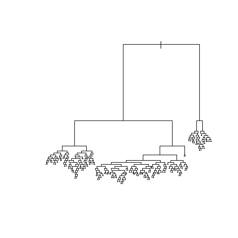

STAT406 - Lecture 10 notes
================
Matias Salibian-Barrera
2017-10-03

Lecture slides
--------------

The lecture slides are [here](STAT406-17-lecture-10-preliminary.pdf).

Regression trees
----------------

Trees provide a non-parametric regression estimator that is able to overcome a serious limitation of "classical non-parametric" estimators (like those based on splines, or kernels) when several (more than 2 or 3) explanatory variables are available.

Below we first describe the problem afflicting classical non-parametric methods (this is also known as the "curse of dimensionality") and then describe how to compute regression trees in `R` using the `rpart` package (although other implementations exist). Details were discussed in class.

### Curse of dimensionality

Suppose you have a random sample of *n = 100* observations, uniformly distributed on the \[0, 1\] interval. How many do you expect to find within 0.25 of the middle point of the interval (i.e. how many will be between 0.25 and 0.75)? A trivial calculation shows that the expected number of observations falling between 0.25 and 0.75 will be *n/2*, in this case *50*. This is easy verified with a simple numerical experiment:

``` r
# X ~ U(0,1)
# how many points do you expect within 0.25 of 1/2?
set.seed(1234)
n <- 100
x <- runif(n)
( sum( abs(x-1/2) < 0.25 ) )# half the width of the dist'n
```

    ## [1] 50

(wow! what are the chances?)

Consider now a sample of 100 observations, each with 5 variables (5-dimensional observations), uniformly distributed in the 5-dimensional unit cube (*\[0,1\]^5*). How many do you expect to see in the *central hypercube* with sides \[0.25, 0.75\] x \[0.25, 0.75\] ... x \[0.25, 0.75\] = \[0.25, 0.75\]^5? A simple experiment shows that this number is probably rather small:

``` r
p <- 5
x <- matrix( runif(n*p), n, p)
# how many points in the hypercube (0.25, 0.75)^p ?
tmp <- apply(x, 1, function(a) all(abs(a-1/2)<0.25))
( sum(tmp) )
```

    ## [1] 4

In fact, the expected number of observations in that central hypercube is exactly *n / 2^5*, which is approximately *3* when *n = 100*.

A relevant question for our local regression estimation problem is: "how large should our sample be if we want to have about 50 observations in our central hypercube?". Easy calculations show that this number is *50 / (1/2)^p*, which, for *p = 5* is *1600*. Again, we can verify this with a simple experiment:

``` r
# how many obs do we need to have 50 in the hypercube?
n <- 50 / (0.5^p)
x <- matrix( runif(n*p), n, p)
# how many points in the hypercube (0.25, 0.75)^p ?
tmp <- apply(x, 1, function(a) all(abs(a-1/2)<0.25))
( sum(tmp) )
```

    ## [1] 57

However, when *p = 10*, in order to expect 50 observations in the central \[0.25, 0.75\] hypercube we need a sample of size *n = 51,200* and when *p = 20* we need over 52 million observations to have (just!) 50 in the central hypercube!

Another way to illustrate this problem is to ask: "given a sample size of *n = 1000*, say, how wide / large should the central hypercube be to expect about *50* observations in it?". The answer is easily found to be *1 / (2 (n/50)^(1/p))*, which for *n = 1000* and *p = 5* equals 0.27, with *p = 10* is 0.37 and with *p = 20* is 0.43, almost the full unit hypercube!

In other words, in moderate to high dimensions, *local neighbourhoods* are either empty or not *local*.

``` r
# how wide should the hypercube be to get 50 neighbours
# with sample of 1000 points?
n <- 1000
p <- 20
( h <- 1 / ((n / 50)^(1/p) * 2) )
```

    ## [1] 0.4304458

``` r
# the sides of the "central hypercube" should be:
( c(0.50 - h, 0.50 + h) )
```

    ## [1] 0.06955417 0.93044583

``` r
# verify it with a single sample:
x <- matrix( runif(n*p), n, p)
# how many points in the hypercube (0.25, 0.75)^p ?
tmp <- apply(x, 1, h=h, function(a,h) all(abs(a-1/2)<h))
( sum(tmp) )
```

    ## [1] 54

### Regression trees as constrained non-parametric regression

Regression trees provide an alternative non-regression estimator that works well, even with many available features. As discussed in class, the basic idea is to approximate the regression function by a linear combination of "simple" functions (i.e. functions *h(x) = I( x A)* which equals 1 if the argument *x* belongs to the set *A* and 0 otherwise. Each function has its own support set *A*. Furthermore, this linear combination is not computed at once, but iteratively, and only considering a specific class of sets *A* (which ones?) As a result, the regression tree is not the *global* optimal approximation by functions of this type, but a good one that can be computed very rapidly. Details were discussed in class, refer to your notes and the corresponding slides.

There are several packages in `R` implementing trees, in this course we will use `rpart`. To illustrate their use we will consider the `Boston` data set, that contains information on housing in the US city of Boston. The corresponding help page contains more information.

To simplify the comparison of the predictions obtained by trees and other regression estimators, we first randomly split the available data into a training and test set:

``` r
library(rpart)
data(Boston, package='MASS')
# split data into a training and
# a test set
set.seed(123456) 
n <- nrow(Boston)
ii <- sample(n, floor(n/4))
dat.te <- Boston[ ii, ]
dat.tr <- Boston[ -ii, ]
```

We now build a regression tree, leaving most of the arguments to their default values. We specify the response and explanatory variables using a `formula`, as usual, and the argument `method` to indicate we need a regression tree (as opposed to a classification one, for example). Finally, we use the corresponding `plot` method to display the tree structure: <!-- # ```{r tree2, fig.width=6, fig.height=6, message=FALSE, warning=FALSE} --> <!-- # set.seed(123) --> <!-- # bos.t <- rpart(medv ~ ., data=dat.tr, method='anova') --> <!-- # plot(bos.t, uniform=TRUE, margin=0.05) --> <!-- # text(bos.t, pretty=TRUE) --> <!-- # ``` --> <!-- Another plot? -->

``` r
set.seed(123)
bos.t <- rpart(medv ~ ., data=dat.tr, method='anova')
plot(bos.t, uniform=FALSE, margin=0.05)
text(bos.t, pretty=TRUE)
```


A few questions for you to work on:

-   Why do we need / want to set the pseudo-random generation seed before calling `rpart`? Is there anything random about building these trees?
-   What does the `uniform` argument for `plot.rpart` do? What does `text` do here?

#### Compare predictions

Estimated MSPE for the tree using the test set:

``` r
# predictions on the test set
pr.t <- predict(bos.t, newdata=dat.te, type='vector')
with(dat.te, mean( (medv - pr.t)^2) )
```

    ## [1] 24.43552

Estimated MSPE for a full linear model using the test set:

``` r
# full linear model
bos.lm <- lm(medv ~ ., data=dat.tr)
pr.lm <- predict(bos.lm, newdata=dat.te)
with(dat.te, mean( (medv - pr.lm)^2) )
```

    ## [1] 26.60311

Estimated MSPE for a linear model constructed via stepwise:

``` r
library(MASS)
null <- lm(medv ~ 1, data=dat.tr)
full <- lm(medv ~ ., data=dat.tr)
bos.aic <- stepAIC(null, scope=list(lower=null, upper=full), trace=FALSE)
pr.aic <- predict(bos.aic, newdata=dat.te)
with(dat.te, mean( (medv - pr.aic)^2 ) )
```

    ## [1] 25.93452

Estimated MSPE of the "optimal" LASSO fit:

``` r
# LASSO?
library(glmnet)
x.tr <- as.matrix(dat.tr[,-14])
y.tr <- as.vector(dat.tr$medv)
set.seed(123)
bos.la <- cv.glmnet(x=x.tr, y=y.tr, alpha=1)
x.te <- as.matrix(dat.te[,-14])
pr.la <- predict(bos.la, s='lambda.1se', newx=x.te)
with(dat.te, mean( (medv - pr.la)^2 ) )
```

    ## [1] 29.20216

A very good exercise for you would be to repeat the above comparison for different training/test splits, or even better, using all the data for training and K-fold CV to estimate the different MSPEs.

#### Pruning regression trees

``` r
# build a big tree (overfitting?)
myc <- rpart.control(minsplit=3, cp=1e-8, xval=10)
set.seed(123)
bos.to <- rpart(medv ~ ., data=dat.tr, method='anova',
                control=myc)
plot(bos.to, compress=TRUE) # type='proportional')
```



``` r
# predictions are poor, unsurprisingly
pr.to <- predict(bos.to, newdata=dat.te, type='vector')
with(dat.te, mean((medv - pr.to)^2) )
```

    ## [1] 36.51097

Prune it.

``` r
plot(bos.to, margin=0.05)
```


Find cp corresponding to smallest cv-estimated prediction error.

``` r
printcp(bos.to)
```

    ## 
    ## Regression tree:
    ## rpart(formula = medv ~ ., data = dat.tr, method = "anova", control = myc)
    ## 
    ## Variables actually used in tree construction:
    ##  [1] age     black   chas    crim    dis     indus   lstat   nox    
    ##  [9] ptratio rad     rm      tax     zn     
    ## 
    ## Root node error: 33010/380 = 86.869
    ## 
    ## n= 380 
    ## 
    ##             CP nsplit rel error  xerror     xstd
    ## 1   4.8583e-01      0 1.0000000 1.00717 0.093142
    ## 2   1.6116e-01      1 0.5141667 0.55925 0.057254
    ## 3   6.4179e-02      2 0.3530038 0.41102 0.046946
    ## 4   5.5119e-02      3 0.2888251 0.36320 0.052820
    ## 5   3.4229e-02      4 0.2337058 0.34482 0.050358
    ## 6   2.9005e-02      5 0.1994769 0.30971 0.049040
    ## 7   1.6086e-02      6 0.1704715 0.26839 0.047553
    ## 8   1.1097e-02      7 0.1543852 0.25793 0.044987
    ## 9   9.3796e-03      8 0.1432884 0.23574 0.037247
    ## 10  9.2703e-03      9 0.1339088 0.26114 0.047891
    ## 11  8.7692e-03     10 0.1246385 0.26001 0.047785
    ## 12  7.7928e-03     11 0.1158693 0.25402 0.047728
    ## 13  6.6572e-03     12 0.1080766 0.25062 0.047732
    ## 14  5.4505e-03     13 0.1014193 0.24476 0.046452
    ## 15  5.0968e-03     14 0.0959689 0.24633 0.047325
    ## 16  4.2783e-03     15 0.0908721 0.24511 0.047325
    ## 17  4.1533e-03     16 0.0865937 0.24437 0.047361
    ## 18  4.0140e-03     17 0.0824404 0.24385 0.047367
    ## 19  2.6191e-03     18 0.0784264 0.25009 0.048241
    ## 20  2.5594e-03     19 0.0758073 0.24588 0.046215
    ## 21  2.3391e-03     20 0.0732479 0.24720 0.046313
    ## 22  2.3363e-03     21 0.0709089 0.24684 0.046350
    ## 23  1.9136e-03     23 0.0662363 0.25078 0.046453
    ## 24  1.8273e-03     24 0.0643227 0.25661 0.046259
    ## 25  1.8004e-03     25 0.0624953 0.25608 0.046239
    ## 26  1.7997e-03     26 0.0606949 0.25608 0.046239
    ## 27  1.7983e-03     27 0.0588952 0.25608 0.046239
    ## 28  1.7521e-03     29 0.0552987 0.25551 0.046232
    ## 29  1.7456e-03     30 0.0535466 0.25534 0.046245
    ## 30  1.7035e-03     31 0.0518010 0.25396 0.046119
    ## 31  1.6719e-03     32 0.0500975 0.25901 0.046168
    ## 32  1.6417e-03     33 0.0484255 0.25892 0.046176
    ## 33  1.5552e-03     34 0.0467839 0.25724 0.046136
    ## 34  1.4516e-03     35 0.0452287 0.25641 0.046145
    ## 35  1.4414e-03     36 0.0437771 0.25704 0.046145
    ## 36  1.4377e-03     37 0.0423356 0.25704 0.046145
    ## 37  1.3450e-03     39 0.0394602 0.25594 0.046063
    ## 38  1.2749e-03     40 0.0381151 0.25664 0.046020
    ## 39  1.2215e-03     41 0.0368402 0.25787 0.046012
    ## 40  9.8996e-04     42 0.0356187 0.25597 0.044855
    ## 41  9.2997e-04     43 0.0346288 0.25436 0.045300
    ## 42  9.2095e-04     44 0.0336988 0.25424 0.045297
    ## 43  8.9900e-04     45 0.0327779 0.25474 0.045311
    ## 44  8.3153e-04     46 0.0318788 0.25330 0.045230
    ## 45  7.7598e-04     47 0.0310473 0.25327 0.045257
    ## 46  7.6105e-04     48 0.0302713 0.25466 0.045402
    ## 47  7.2813e-04     49 0.0295103 0.25404 0.045396
    ## 48  7.2476e-04     50 0.0287822 0.25402 0.045398
    ## 49  6.9801e-04     51 0.0280574 0.25410 0.045403
    ## 50  6.6252e-04     52 0.0273594 0.25563 0.045415
    ## 51  6.2526e-04     53 0.0266969 0.25617 0.045452
    ## 52  6.1499e-04     54 0.0260716 0.25370 0.045432
    ## 53  5.4165e-04     55 0.0254566 0.25793 0.045662
    ## 54  5.3418e-04     56 0.0249150 0.26016 0.045639
    ## 55  5.2347e-04     57 0.0243808 0.26163 0.045726
    ## 56  5.1389e-04     58 0.0238573 0.26162 0.045727
    ## 57  5.1165e-04     59 0.0233434 0.26140 0.045730
    ## 58  5.0244e-04     60 0.0228318 0.26172 0.045731
    ## 59  5.0225e-04     61 0.0223293 0.26255 0.045743
    ## 60  4.9246e-04     62 0.0218271 0.26255 0.045743
    ## 61  4.7451e-04     63 0.0213346 0.26253 0.045743
    ## 62  4.5859e-04     64 0.0208601 0.26176 0.045724
    ## 63  4.3688e-04     65 0.0204015 0.26176 0.045775
    ## 64  4.3625e-04     66 0.0199647 0.26092 0.045774
    ## 65  4.1909e-04     67 0.0195284 0.26070 0.045777
    ## 66  4.1564e-04     68 0.0191093 0.26102 0.045780
    ## 67  3.9315e-04     69 0.0186937 0.26116 0.045781
    ## 68  3.9232e-04     70 0.0183005 0.26030 0.045780
    ## 69  3.8884e-04     71 0.0179082 0.26048 0.045778
    ## 70  3.8215e-04     72 0.0175194 0.26102 0.045797
    ## 71  3.6565e-04     73 0.0171372 0.26017 0.045116
    ## 72  3.6474e-04     74 0.0167716 0.25964 0.045046
    ## 73  3.5279e-04     76 0.0160421 0.25979 0.045048
    ## 74  3.4059e-04     79 0.0149837 0.25973 0.045048
    ## 75  3.3386e-04     80 0.0146431 0.25986 0.045048
    ## 76  3.2990e-04     81 0.0143093 0.25974 0.045049
    ## 77  3.0830e-04     82 0.0139794 0.25986 0.045050
    ## 78  3.0718e-04     83 0.0136711 0.26067 0.045046
    ## 79  2.9368e-04     84 0.0133639 0.26089 0.045018
    ## 80  2.8903e-04     85 0.0130702 0.26043 0.045020
    ## 81  2.8429e-04     86 0.0127812 0.26043 0.045020
    ## 82  2.8335e-04     87 0.0124969 0.26067 0.045018
    ## 83  2.7721e-04     88 0.0122136 0.26058 0.045019
    ## 84  2.7305e-04     89 0.0119364 0.26036 0.045021
    ## 85  2.6665e-04     90 0.0116633 0.26038 0.045020
    ## 86  2.6539e-04     91 0.0113967 0.25950 0.045014
    ## 87  2.6265e-04     92 0.0111313 0.25950 0.045014
    ## 88  2.5655e-04     93 0.0108686 0.25956 0.045016
    ## 89  2.5556e-04     94 0.0106121 0.25949 0.045017
    ## 90  2.2912e-04     96 0.0101009 0.26173 0.045018
    ## 91  2.2306e-04     98 0.0096427 0.26365 0.045070
    ## 92  2.1408e-04     99 0.0094196 0.26300 0.045064
    ## 93  2.1328e-04    101 0.0089915 0.26226 0.045046
    ## 94  1.9765e-04    102 0.0087782 0.26236 0.045046
    ## 95  1.9678e-04    104 0.0083829 0.26206 0.045048
    ## 96  1.9510e-04    106 0.0079893 0.26128 0.045047
    ## 97  1.7138e-04    107 0.0077942 0.26188 0.045044
    ## 98  1.5672e-04    108 0.0076229 0.26363 0.045059
    ## 99  1.5642e-04    109 0.0074661 0.26438 0.045064
    ## 100 1.5586e-04    111 0.0071533 0.26438 0.045064
    ## 101 1.4662e-04    112 0.0069974 0.26439 0.045062
    ## 102 1.4541e-04    113 0.0068508 0.26513 0.045058
    ## 103 1.3824e-04    114 0.0067054 0.26779 0.046019
    ## 104 1.3787e-04    115 0.0065672 0.26739 0.046017
    ## 105 1.3712e-04    116 0.0064293 0.26739 0.046017
    ## 106 1.3695e-04    117 0.0062922 0.26733 0.046018
    ## 107 1.2442e-04    118 0.0061552 0.26737 0.046020
    ## 108 1.2269e-04    119 0.0060308 0.26765 0.046019
    ## 109 1.1346e-04    120 0.0059081 0.26754 0.046022
    ## 110 1.1045e-04    122 0.0056812 0.26825 0.046032
    ## 111 1.0997e-04    123 0.0055708 0.26830 0.046032
    ## 112 1.0386e-04    124 0.0054608 0.26810 0.046027
    ## 113 1.0340e-04    125 0.0053569 0.26908 0.046028
    ## 114 1.0259e-04    126 0.0052535 0.26908 0.046028
    ## 115 1.0224e-04    127 0.0051509 0.26908 0.046028
    ## 116 1.0185e-04    128 0.0050487 0.26898 0.046025
    ## 117 9.5993e-05    129 0.0049468 0.26938 0.046022
    ## 118 9.3355e-05    130 0.0048509 0.26945 0.046022
    ## 119 8.4873e-05    131 0.0047575 0.26889 0.046026
    ## 120 8.3440e-05    132 0.0046726 0.26761 0.045989
    ## 121 8.2229e-05    134 0.0045057 0.26761 0.045989
    ## 122 7.8362e-05    135 0.0044235 0.26818 0.046021
    ## 123 7.8315e-05    137 0.0042668 0.26819 0.046021
    ## 124 7.8013e-05    138 0.0041885 0.26819 0.046021
    ## 125 7.4782e-05    139 0.0041105 0.26842 0.046018
    ## 126 7.4219e-05    140 0.0040357 0.26870 0.046015
    ## 127 7.3614e-05    141 0.0039615 0.26884 0.046014
    ## 128 7.2907e-05    142 0.0038878 0.26884 0.046014
    ## 129 7.0912e-05    143 0.0038149 0.26929 0.046022
    ## 130 7.0692e-05    144 0.0037440 0.26929 0.046022
    ## 131 6.9075e-05    145 0.0036733 0.26933 0.046021
    ## 132 6.1850e-05    146 0.0036043 0.26936 0.046021
    ## 133 6.1850e-05    147 0.0035424 0.26975 0.046261
    ## 134 6.0118e-05    148 0.0034806 0.27000 0.046262
    ## 135 5.9870e-05    149 0.0034204 0.26988 0.046260
    ## 136 5.9376e-05    150 0.0033606 0.27002 0.046259
    ## 137 5.8164e-05    151 0.0033012 0.27000 0.046259
    ## 138 5.8164e-05    152 0.0032430 0.27000 0.046259
    ## 139 5.3812e-05    153 0.0031849 0.27031 0.046260
    ## 140 4.8874e-05    154 0.0031311 0.27113 0.046376
    ## 141 4.8520e-05    155 0.0030822 0.27063 0.046357
    ## 142 4.8076e-05    156 0.0030337 0.27095 0.046356
    ## 143 4.5440e-05    157 0.0029856 0.27093 0.046357
    ## 144 4.1472e-05    158 0.0029401 0.27101 0.046356
    ## 145 3.9625e-05    159 0.0028987 0.27131 0.046357
    ## 146 3.8397e-05    161 0.0028194 0.27118 0.046357
    ## 147 3.6807e-05    162 0.0027810 0.27146 0.046355
    ## 148 3.6453e-05    163 0.0027442 0.27139 0.046357
    ## 149 3.6064e-05    164 0.0027078 0.27139 0.046357
    ## 150 3.4560e-05    165 0.0026717 0.27139 0.046357
    ## 151 3.4560e-05    166 0.0026371 0.27113 0.046356
    ## 152 3.4560e-05    167 0.0026026 0.27114 0.046356
    ## 153 3.4415e-05    168 0.0025680 0.27114 0.046356
    ## 154 3.4131e-05    169 0.0025336 0.27114 0.046356
    ## 155 3.1556e-05    170 0.0024995 0.27059 0.046348
    ## 156 3.1556e-05    171 0.0024679 0.27059 0.046348
    ## 157 3.1556e-05    172 0.0024364 0.27059 0.046348
    ## 158 3.1246e-05    173 0.0024048 0.27081 0.046369
    ## 159 3.0925e-05    174 0.0023736 0.27081 0.046369
    ## 160 3.0925e-05    175 0.0023426 0.27081 0.046369
    ## 161 3.0672e-05    176 0.0023117 0.27081 0.046369
    ## 162 3.0294e-05    177 0.0022810 0.27076 0.046370
    ## 163 3.0294e-05    178 0.0022507 0.27076 0.046370
    ## 164 2.9082e-05    179 0.0022205 0.27079 0.046369
    ## 165 2.4343e-05    180 0.0021914 0.27070 0.046363
    ## 166 2.4235e-05    181 0.0021670 0.27097 0.046363
    ## 167 2.3266e-05    182 0.0021428 0.27095 0.046363
    ## 168 2.0448e-05    183 0.0021195 0.27139 0.046361
    ## 169 2.0196e-05    184 0.0020991 0.27115 0.046364
    ## 170 2.0196e-05    185 0.0020789 0.27108 0.046364
    ## 171 1.8671e-05    186 0.0020587 0.27100 0.046365
    ## 172 1.8284e-05    187 0.0020400 0.27109 0.046364
    ## 173 1.7065e-05    188 0.0020217 0.27098 0.046365
    ## 174 1.6359e-05    189 0.0020047 0.27098 0.046365
    ## 175 1.6157e-05    191 0.0019720 0.27098 0.046365
    ## 176 1.4844e-05    192 0.0019558 0.27112 0.046364
    ## 177 1.2925e-05    193 0.0019410 0.27115 0.046364
    ## 178 1.2925e-05    194 0.0019280 0.27130 0.046363
    ## 179 1.1360e-05    195 0.0019151 0.27093 0.046214
    ## 180 1.1042e-05    196 0.0019037 0.27094 0.046214
    ## 181 1.1042e-05    197 0.0018927 0.27094 0.046214
    ## 182 1.0239e-05    198 0.0018817 0.27089 0.046214
    ## 183 9.8959e-06    199 0.0018714 0.27092 0.046214
    ## 184 8.5327e-06    202 0.0018417 0.27085 0.046213
    ## 185 8.1793e-06    203 0.0018332 0.27081 0.046212
    ## 186 7.2957e-06    204 0.0018250 0.27114 0.046221
    ## 187 7.2957e-06    205 0.0018177 0.27114 0.046221
    ## 188 7.2957e-06    206 0.0018104 0.27114 0.046221
    ## 189 7.2705e-06    207 0.0018031 0.27114 0.046221
    ## 190 7.2705e-06    208 0.0017959 0.27114 0.046221
    ## 191 7.2705e-06    209 0.0017886 0.27114 0.046221
    ## 192 6.3112e-06    210 0.0017813 0.27112 0.046223
    ## 193 6.1092e-06    211 0.0017750 0.27113 0.046223
    ## 194 6.1092e-06    212 0.0017689 0.27113 0.046223
    ## 195 5.6801e-06    213 0.0017628 0.27113 0.046223
    ## 196 5.0489e-06    214 0.0017571 0.27126 0.046222
    ## 197 5.0489e-06    215 0.0017521 0.27126 0.046222
    ## 198 5.0489e-06    217 0.0017420 0.27126 0.046222
    ## 199 4.9480e-06    218 0.0017369 0.27126 0.046222
    ## 200 4.2664e-06    219 0.0017320 0.27126 0.046222
    ## 201 4.2664e-06    220 0.0017277 0.27125 0.046222
    ## 202 4.0896e-06    221 0.0017234 0.27125 0.046222
    ## 203 4.0896e-06    222 0.0017193 0.27123 0.046222
    ## 204 3.7110e-06    223 0.0017153 0.27126 0.046223
    ## 205 3.6352e-06    224 0.0017115 0.27126 0.046223
    ## 206 3.2313e-06    225 0.0017079 0.27141 0.046228
    ## 207 2.7264e-06    226 0.0017047 0.27138 0.046228
    ## 208 2.4740e-06    228 0.0016992 0.27140 0.046228
    ## 209 2.4740e-06    229 0.0016967 0.27140 0.046228
    ## 210 2.4740e-06    230 0.0016943 0.27140 0.046228
    ## 211 2.4740e-06    232 0.0016893 0.27140 0.046228
    ## 212 1.8176e-06    234 0.0016844 0.27136 0.046228
    ## 213 1.8176e-06    235 0.0016826 0.27140 0.046228
    ## 214 1.2622e-06    237 0.0016789 0.27144 0.046228
    ## 215 1.2622e-06    238 0.0016777 0.27147 0.046227
    ## 216 1.2622e-06    241 0.0016739 0.27147 0.046227
    ## 217 1.2622e-06    242 0.0016726 0.27147 0.046227
    ## 218 8.0783e-07    243 0.0016714 0.27147 0.046227
    ## 219 8.0783e-07    245 0.0016697 0.27147 0.046227
    ## 220 4.5440e-07    246 0.0016689 0.27147 0.046227
    ## 221 4.5440e-07    248 0.0016680 0.27149 0.046227
    ## 222 2.0196e-07    249 0.0016676 0.27151 0.046227
    ## 223 1.0000e-08    250 0.0016674 0.27153 0.046227

Prune and plot prunned tree:

``` r
b <- bos.to$cptable[which.min(bos.to$cptable[,"xerror"]),"CP"]
bos.t3 <- prune(bos.to, cp=b)
plot(bos.t3, uniform=FALSE)
text(bos.t3, pretty=TRUE)
```


Predictions improve:

``` r
# predictions are better
pr.t3 <- predict(bos.t3, newdata=dat.te, type='vector')
with(dat.te, mean((medv - pr.t3)^2) )
```

    ## [1] 18.96988

Pruning doesn't always improve a tree:

``` r
# what if we prune the original tree?
b <- bos.t$cptable[which.min(bos.t$cptable[,"xerror"]),"CP"]
bos.t4 <- prune(bos.t, cp=b)
plot(bos.t4, uniform=FALSE, margin=0.05)
text(bos.t4, pretty=TRUE)
```


Pruning gives the same tree as the original

``` r
plot(bos.t, uniform=FALSE, margin=0.05)
text(bos.t, pretty=TRUE)
```


<!-- Sanity check: -->
<!-- ```{r prune7, fig.width=6, fig.height=6, message=FALSE, warning=FALSE} -->
<!-- pr.t4 <- predict(bos.t4, newdata=dat.te, type='vector') -->
<!-- with(dat.te, mean((medv - pr.t4)^2) ) -->
<!-- # same tree, really -->
<!-- with(dat.te, mean((medv - pr.t)^2) ) -->
<!-- ``` -->
