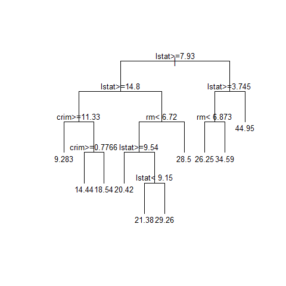
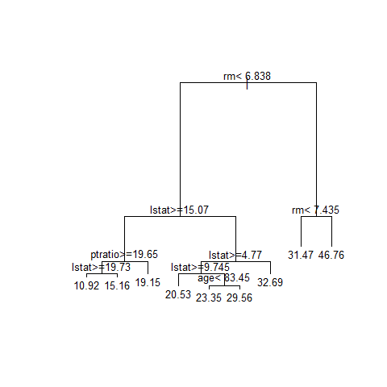

STAT406 - Lecture 11 notes
================
Matias Salibian-Barrera
2017-10-05

#### LICENSE

These notes are released under the "Creative Commons Attribution-ShareAlike 4.0 International" license. See the **human-readable version** [here](https://creativecommons.org/licenses/by-sa/4.0/) and the **real thing** [here](https://creativecommons.org/licenses/by-sa/4.0/legalcode).

Lecture slides
--------------

The lecture slides are [here](STAT406-17-lecture-11-preliminary.pdf).

Instability of regression trees
-------------------------------

Trees can be rather unstable, in the sense that small changes in the training data set may result in relatively large differences in the fitted trees. As a simple illustration we randomly split the `Boston` data used before into two halves and fit a regression tree to each portion. We then display both trees.

``` r
# Instability of trees...
library(rpart)
data(Boston, package='MASS')
set.seed(654321)
n <- nrow(Boston)
ii <- sample(n, floor(n/2))
dat.t1 <- Boston[ -ii, ]
bos.t1 <- rpart(medv ~ ., data=dat.t1, method='anova')
plot(bos.t1, uniform=FALSE, margin=0.05)
text(bos.t1, pretty=TRUE, cex=.8)
```



``` r
dat.t2 <- Boston[ ii, ]
bos.t2 <- rpart(medv ~ ., data=dat.t2, method='anova')
plot(bos.t2, uniform=FALSE, margin=0.05)
text(bos.t2, pretty=TRUE, cex=.8)
```



Although we would expect both random halves of the same (moderately large) training set to beat least qualitatively similar, Note that the two trees are rather different. To compare with a more stable predictor, we fit a linear regression model to each half, and look at the two sets of estimated coefficients side by side:

``` r
# bos.lmf <- lm(medv ~ ., data=Boston)
bos.lm1 <- lm(medv ~ ., data=dat.t1)
bos.lm2 <- lm(medv ~ ., data=dat.t2)
cbind(round(coef(bos.lm1),2),
round(coef(bos.lm2),2))
```

    ##               [,1]   [,2]
    ## (Intercept)  39.21  33.12
    ## crim         -0.13  -0.10
    ## zn            0.04   0.05
    ## indus         0.04  -0.01
    ## chas          2.72   2.80
    ## nox         -20.07 -14.18
    ## rm            3.45   4.15
    ## age           0.00   0.00
    ## dis          -1.44  -1.46
    ## rad           0.28   0.34
    ## tax          -0.01  -0.02
    ## ptratio      -1.01  -0.90
    ## black         0.01   0.01
    ## lstat        -0.56  -0.50

Note that most of the estimated regression coefficients are similar, and all of them are at least qualitatively comparable.

Bagging
-------

One strategy to obtain more stable predictors is called **Bootstrap AGGregatING** (bagging). It can be applied to many predictors (not only trees), and it generally results in larger improvements in prediction quality when it is used with predictors that are flexible (low bias), but highly variable.

The justification and motivation were discussed in class. Intuitively we are averaging the predictions obtained from an estimate of the "average prediction" we would have computed had we had access to several (many?) independent training sets (samples).

There are several (many?) `R` packages implementing bagging for different predictors, with varying degrees of flexibility (the implementations) and user-friendliness. However, for pedagogical and illustrative purposes, in these notes I will *bagg* by hand.

### Bagging by hand

Again, to simplify the discussion and presentation, in order to evaluate prediction quality I will split the data (`Boston`) into a training and a test set. We do this now:

``` r
set.seed(123456)
n <- nrow(Boston)
ii <- sample(n, floor(n/4))
dat.te <- Boston[ ii, ]
dat.tr <- Boston[ -ii, ]
```

I will now train *N* = 5 trees and average their predictions. Note that, in order to illustrate the process more clearly, I will compute and store the *N* × *n*<sub>*e*</sub> predictions, where *n*<sub>*e*</sub> denotes the number of observations in the test set.

<!-- myc <- tree.control(nobs=nrow(dat.tr), mincut=1, minsize=2,  -->
<!--                     mindev=1e-5) -->
<!-- N <- 5 # 5 500 2000 5000 all improve, but less each time -->
<!-- # [1] 13.89539, [1] 12.08049, [1] 11.87869, [1] 11.77328 -->
<!-- myps <- matrix(NA, nrow(dat.te), N) -->
<!-- n.tr <- nrow(dat.tr) -->
<!-- set.seed(123456) -->
<!-- for(j in 1:N) { -->
<!--   ii <- sample(n.tr, replace=TRUE) -->
<!--   tmp <- tree(medv ~ ., data=dat.tr[ii,], split='deviance', -->
<!--                     control=myc) -->
<!--   myps[,j] <- predict(tmp, newdata=dat.te, type='vector') -->
<!-- } -->
<!-- pr.ba <- rowMeans(myps) -->
<!-- mean((dat.te$medv - pr.ba)^2) -->
### Bagging a regression spline

<!-- data(lidar, package='SemiPar') -->
<!-- plot(logratio~range, data=lidar, pch=19, col='gray', cex=2.5) -->
<!-- # split in training and testing  -->
<!-- set.seed(123456)  -->
<!-- n <- nrow(lidar) -->
<!-- ii <- sample(n, floor(n/5)) -->
<!-- lid.te <- lidar[ ii, ] -->
<!-- lid.tr <- lidar[ -ii, ] -->
<!-- bound <- c(min(lidar$range), max(lidar$range)) -->
<!-- library(splines) -->
<!-- a <- lm(logratio ~ bs(x=range, df=30, Boundary.knots=bound), data=lid.tr) -->
<!-- oo <- order(lid.tr$range) -->
<!-- plot(logratio~range, data=lid.tr, pch=19, col='gray', cex=2.5) -->
<!-- lines(predict(a)[oo] ~ lid.tr$range[oo], lwd=4, col='red') -->
<!-- pr.of <- predict(a, newdata=lid.te) -->
<!-- mean( (lid.te$logratio - pr.of)^2 ) -->
<!-- N <- 100 # 5 500 1500 -->
<!-- xseq <- seq(min(lidar$range), max(lidar$range), length=500) -->
<!-- myps <- matrix(NA, nrow(lid.te), N) -->
<!-- myse <- matrix(NA, length(xseq), N) -->
<!-- set.seed(123456) -->
<!-- n.tr <- nrow(lid.tr) -->
<!-- for(i in 1:N) { -->
<!--   ii <- sample(n.tr, replace=TRUE) -->
<!--   a.b <- lm(logratio ~ bs(x=range, df=30, Boundary.knots=bound), data=lid.tr[ii,]) -->
<!--     # try(lm(logratio ~ bs(x=range, df=30, Boundary.knots=bound), data=lid.tr[ii,]), silent=TRUE) -->
<!-- #  if(class(a.b) != 'try-error') { -->
<!--   myps[,i] <- predict(a.b, newdata=lid.te) -->
<!--   myse[,i] <- predict(a.b, newdata=list(range=xseq)) -->
<!-- #  } -->
<!-- } -->
<!-- pr.ba <- rowMeans(myps)# , na.rm=TRUE) -->
<!-- mean( (lid.te$logratio - pr.ba)^2 ) -->
<!-- pr.se <- rowMeans(myse)# , na.rm=TRUE) -->
<!-- pr.ofse <- predict(a, newdata=list(range=xseq)) -->
<!-- plot(logratio~range, data=lidar, pch=19, col='gray', cex=2.5) -->
<!-- points(logratio~range, data=lid.tr, pch=19, col='gray30', cex=.75) -->
<!-- points(logratio~range, data=lid.te, pch=19, col='blue', cex=.75) -->
<!-- lines(pr.ofse ~ xseq, lwd=4, col='red') -->
<!-- lines(pr.se ~ xseq, lwd=4, col='magenta') -->
