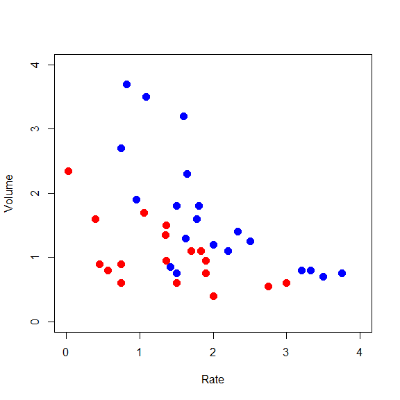

STAT406 - Lecture 12 notes
================
Matias Salibian-Barrera
2017-10-12

#### LICENSE

These notes are released under the "Creative Commons Attribution-ShareAlike 4.0 International" license. See the **human-readable version** [here](https://creativecommons.org/licenses/by-sa/4.0/) and the **real thing** [here](https://creativecommons.org/licenses/by-sa/4.0/legalcode).

Lecture slides
--------------

The lecture slides are [here](STAT406-17-lecture-12-preliminary.pdf).

Bagging
-------

One strategy to obtain more stable predictors is called **Bootstrap AGGregatING** (bagging). It can be applied to many predictors (not only trees), and it generally results in larger improvements in prediction quality when it is used with predictors that are flexible (low bias), but highly variable.

The justification and motivation were discussed in class. Intuitively we are averaging the predictions obtained from an estimate of the "average prediction" we would have computed had we had access to several (many?) independent training sets (samples).

There are several (many?) `R` packages implementing bagging for different predictors, with varying degrees of flexibility (the implementations) and user-friendliness. However, for pedagogical and illustrative purposes, in these notes I will *bagg* by hand.

### Bagging by hand

Again, to simplify the discussion and presentation, in order to evaluate prediction quality I will split the data (`Boston`) into a training and a test set. We do this now:

``` r
library(rpart)
data(Boston, package='MASS')
set.seed(123456)
n <- nrow(Boston)
ii <- sample(n, floor(n/4))
dat.te <- Boston[ ii, ]
dat.tr <- Boston[ -ii, ]
```

I will now train *N* = 5 trees and average their predictions. Note that, in order to illustrate the process more clearly, I will compute and store the *N* × *n*<sub>*e*</sub> predictions, where *n*<sub>*e*</sub> denotes the number of observations in the test set. This is not the best (most efficient) way of implementing *bagging*, but the main purpose here is to understand **what** we are doing. Also note that an alternative (better in terms of reusability of the ensamble, but maybe still not the most efficient option) would be to store the *N* trees directly. This would also allow for more elegant and easy to read code. Once again, this approach will be sacrificed in the altar of clarity of presentation and pedagogy (but do try it yourself!)

First create an array where we will store all the predictions:

``` r
N <- 5
myps <- array(NA, dim=c(nrow(dat.te), N))
con <- rpart.control(minsplit=3, cp=1e-3, xval=1)
```

The last object (`con`) contains my options to train large (potentially overfitting) trees.

``` r
n.tr <- nrow(dat.tr)
set.seed(123456)
for(j in 1:N) {
  ii <- sample(n.tr, replace=TRUE)
  tmp <- rpart(medv ~ ., data=dat.tr[ii, ], method='anova', control=con)
  myps[,j] <- predict(tmp, newdata=dat.te, type='vector')
}
pr.bagg <- rowMeans(myps)
with(dat.te, mean( (medv - pr.bagg)^2 ) )
```

    ## [1] 14.81517

And compare with predictions from the pruned tree, and the ones from other predictors discussed in the previous note:

``` r
myc <- rpart.control(minsplit=3, cp=1e-8, xval=10)
set.seed(123)
bos.to <- rpart(medv ~ ., data=dat.tr, method='anova',
                control=myc)
b <- bos.to$cptable[which.min(bos.to$cptable[,"xerror"]),"CP"]
bos.t3 <- prune(bos.to, cp=b)
pr.t3 <- predict(bos.t3, newdata=dat.te, type='vector')
with(dat.te, mean((medv - pr.t3)^2) )
```

    ## [1] 18.96988

What if we *bagg* *N* = 10 trees?

    ## [1] 14.80446

or *N* = 100 trees?

    ## [1] 12.71124

or *N* = 1000 trees?

    ## [1] 12.566

Should we consider higher values of *N*? How about other training / test splits? Should we use CV instead?

Another split:

    ## [1]  5.00000 20.32676
    ## [1] 10.00000 20.52832
    ## [1] 100.00000  18.24876
    ## [1] 1000.00000   17.93342

Similar conclusion: increasing *N* helps, but the improvement becomes smaller, while the computational cost keeps increasing.

### Bagging a regression spline

Bagging does not provide much of an advantage when applied to linear predictors (can you explain why?) Nevertheless, let us try it on the `lidar` data, which, as we did before, we randomly split into a training and test set:

``` r
data(lidar, package='SemiPar')
set.seed(123456)
n <- nrow(lidar)
ii <- sample(n, floor(n/5))
lid.te <- lidar[ ii, ]
lid.tr <- lidar[ -ii, ]
```

Now fit a cubic spline, and estimate the MSPE using the test set:

``` r
library(splines)
a <- lm(logratio ~ bs(x=range, df=10, degree=3), data=lid.tr) 
oo <- order(lid.tr$range)
pr.of <- predict(a, newdata=lid.te)
```

    ## Warning in bs(x = range, degree = 3L, knots = structure(c(430, 475, 513, :
    ## some 'x' values beyond boundary knots may cause ill-conditioned bases

``` r
mean( (lid.te$logratio - pr.of)^2 )
```

    ## [1] 0.008443088

We build an ensemble of 10 fits and estimate the corresponding MSPE using the test set:

``` r
N <- 10 # 5 500 1500
myps <- matrix(NA, nrow(lid.te), N)
set.seed(123456)
n.tr <- nrow(lid.tr)
for(i in 1:N) {
  ii <- sample(n.tr, replace=TRUE)
  a.b <- lm(logratio ~ bs(x=range, df=10, degree=3), data=lid.tr[ii,]) 
  myps[,i] <- predict(a.b, newdata=lid.te)
}
pr.ba <- rowMeans(myps)# , na.rm=TRUE)
mean( (lid.te$logratio - pr.ba)^2 )
```

    ## [1] 0.008040338

Linear Discriminant Analysis
----------------------------

``` r
library(MASS)
data(vaso, package='robustbase')
a.lda <- lda(Y ~ Volume + Rate, data=vaso)

# build a grid of points of (Volume, Rate),
# and obtain predictions for each of them
# 40,000 in total
xvol <- seq(0, 4, length=200)
xrat <- seq(0, 4, length=200)
xx <- expand.grid(xvol, xrat)
names(xx) <- c('Volume', 'Rate')

pr.lda <- predict(a.lda, newdata=xx)$posterior[,2]
image(xrat, xvol, matrix(pr.lda, 200, 200), col=terrain.colors(100),
      ylab='Volume', xlab='Rate', main='LDA')
points(Volume ~ Rate, data=vaso, pch=19, cex=1.5,
       col=c('red', 'blue')[Y+1])
```


Logistic regression (Review)
----------------------------

``` r
plot(Volume ~ Rate, data=vaso, pch=19, cex=1.5, col=c('red', 'blue')[Y+1],
     xlim=c(0, 4), ylim=c(0,4))
```



``` r
a <- glm(Y ~ ., data=vaso, family=binomial)

pr <- predict(a, newdata=xx, type='response')

# display them
image(xrat, xvol, matrix(pr, 200, 200), col=terrain.colors(100),
      ylab='Volume', xlab='Rate', main='Logistic')
points(Volume ~ Rate, data=vaso, pch=19, cex=1.5,
       col=c('red', 'blue')[Y+1])
```


``` r
# Y = 1 corresponds to blue points
# higher probabilities are displayed with lighter colors
```
