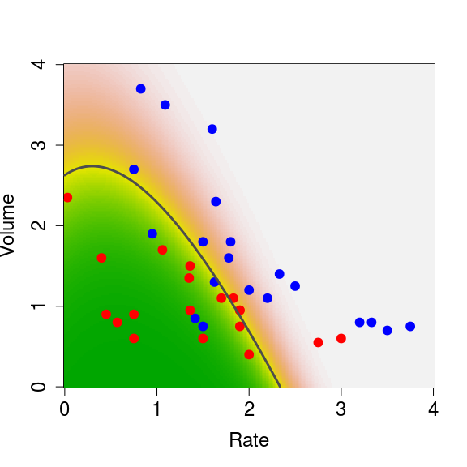
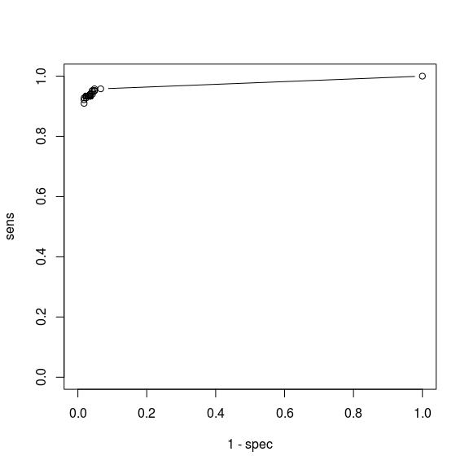

STAT406 - Lecture 15 notes
================
Matias Salibian-Barrera
2017-10-25

LICENSE
-------

These notes are released under the "Creative Commons Attribution-ShareAlike 4.0 International" license. See the **human-readable version** [here](https://creativecommons.org/licenses/by-sa/4.0/) and the **real thing** [here](https://creativecommons.org/licenses/by-sa/4.0/legalcode).

Lecture slides
--------------

The lecture slides are [here](STAT406-17-lecture-15.pdf).

LDA & QDA
---------

Similarly to the way we derived the LDA classifier in class, if one relaxes the assumption that the conditional distribution of the vector of features **X** in each class has the same covariance matrix (*shape*) (but still assumes that these distributions are Gaussian), then it is (again) easy to find a closed form for the conditional probability of each class (conditional on a vector of features **X**). As in the LDA case, these conditional class probabilities (aka *posterior probabilities*) depend on the parameters of the assumed model for the conditional distributions of **X** in each class. So, again, we estimate those parameters from the training set (usin the observations in each group) and plug them in to compute the conditional class probabilities.

Similarly to what we did for LDA, it is easy to see that in this case the class boundaries are quadratic functions of the vector of features **X**.

We now illustrate QDA on the same `vaso` data we used before. We first load the data, and train a QDA classifier using the function `qda` in package `MASS` (this can also be written as `MASS::qda()`).

``` r
data(vaso, package='robustbase')
library(MASS)
a.qda <- qda(Y ~ . , data=vaso)
```

We now build a relatively fine grid of points in the domain of our 2-dimensional vector of features and use the `predict` method associated with a `qda` object to predict the conditional probability of class `blue`:

``` r
xvol <- seq(0, 4, length=200)
xrat <- seq(0, 4, length=200)
xx <- expand.grid(xvol, xrat)
names(xx) <- c('Volume', 'Rate')
pr.qda <- predict(a.qda, newdata=xx)$posterior[,2]
image(xrat, xvol, matrix(pr.qda, 200, 200), col=terrain.colors(100),
      ylab='Volume', xlab='Rate', cex.lab=1.5, cex.axis=1.5)
points(Volume ~ Rate, data=vaso, pch=19, cex=1.5, 
       col=c('red', 'blue')[Y+1])
contour(xrat, xvol, matrix(pr.qda, 200, 200), col='gray30', levels=.5, 
        drawlabels=FALSE, lwd=3, add=TRUE)
```



We used the function `contour` above to draw the boundary between classes (the set of points where the probability of blue is equal to the probability of red).

#### Sensitivity to the Gaussian assumption

With the help of an example we discussed in class the sensitivity of QDA to the assumed specific conditional distribution of the features within each class. It is very easy to see that LDA may also be affected by similar problems. This is not at all surprising--in many cases optimal methods obtained under certain conditions are very sensitive to the vailidity of the assumptions used in ther derivation.

It is interesting to note (as discussed in class) that logistic regression was not affected by the "good outliers" we included in the data. Again, this is not surprising (furthermore, I expect you to be able to explain what is happening in this particular example). Note, furthermore, that both QDA (and LDA) and logistic regression are classifiers that require the estimation of parameters (maybe we can call them *parametric classifiers*?), and in all cases so far we used maximum likelihood estimates for them. However their sensitivity to this kind of outliers is very different. Discuss!

#### More than 2 classes -- The handwritten digit recognition data

As you may have noted, all the classification methods we have seen so far can be used in applications with an arbitrary number of classes. We will now illustrate them on the well-known Handwritten Digit Recognition Data (as usual, see `help(zip.train, package='ElemStatLearn')`). We first load the data, and extract the images corresponding to digits 0, 1 and 8. These should be challenging enough to discriminate given their shape.

``` r
data(zip.train, package='ElemStatLearn')
data(zip.test, package='ElemStatLearn')
x.tr <- zip.train[ zip.train[, 1] %in% c(0, 1, 8), ]
x.te <- zip.test[ zip.test[, 1] %in% c(0, 1, 8), ]
table(x.tr[, 1])
```

    ## 
    ##    0    1    8 
    ## 1194 1005  542

To display these 16x16 images we adapt a simple function to plot matrices:

``` r
# ----- Define a function for plotting a matrix ----- #
# modified from: http://www.phaget4.org/R/image_matrix.html
# ----- Define a function for plotting a matrix ----- #
myImagePlot <- function(x, ...){
  min <- min(x)
  max <- max(x)
  ColorRamp <- grey(seq(1,0,length=256))
  ColorLevels <- seq(min, max, length=length(ColorRamp))
  # Reverse Y axis
  reverse <- nrow(x) : 1
  x <- x[reverse,]
  image(1:ncol(x), 1:nrow(x), t(x), col=ColorRamp, xlab="",
        ylab="", axes=FALSE, zlim=c(min,max))
}
```

We choose 9 images at random and display them in a 3x3 array of images:

``` r
a <- x.tr
set.seed(987)
sa <- sample(dim(a)[1], 9)
par(mfrow=c(3,3))
for(j in 1:9) {
  myImagePlot(t(matrix(unlist(a[sa[j],-1]), 16, 16)))
}
```


``` r
par(mfrow=c(1,1))
```

We can also show the "average 8" in the training set:

``` r
myImagePlot(t(matrix(colMeans(a[a[,1]==8,-1]), 16, 16)))
```


We will now use LDA, QDA and a multinomial logistic model. The latter is the natural extension of logistic regression to more than 2 classes. You can easily derive it yourself by assuming the response variable has a multinomial distribution and modeling each conditional probability as a (different) logistic function of the vector **X** of features. Note that if there are *K* classes you only need to model *K-1* of these conditional class probabilities. The derivation is left as an easy exercise for you.

Note that the data is stored in a matrix, but the use of `lda()`, `qda()`, etc. is clearer when you have your data in a `data frame` (as you can then refer to features by their names and use the `data` argument). So, we first transform our matrix into a data frame, and name the resulting variables *V1*, *V2*, ..., *V257*:

``` r
x.tr <- data.frame(x.tr)
x.te <- data.frame(x.te)
names( x.te ) <- names( x.tr  ) <- paste('V', 1:257, sep='')
```

Now we use `lda` and `multinom` (from package `nnet`) to train an LDA and a multinomial classifier to these 3-class data:

``` r
a <- lda(V1 ~ . - V257, data=x.tr) #x.tr[,1] ~ x[, 2:256])
library(nnet)
a.log <- multinom(V1 ~ . - V257, data=x.tr, maxit=5000)
```

    ## # weights:  771 (512 variable)
    ## initial  value 3011.296283 
    ## iter  10 value 27.327939
    ## iter  20 value 8.491334
    ## iter  30 value 2.640128
    ## iter  40 value 1.228798
    ## iter  50 value 0.663474
    ## iter  60 value 0.391984
    ## iter  70 value 0.212952
    ## iter  80 value 0.114876
    ## iter  90 value 0.053465
    ## iter 100 value 0.026628
    ## iter 110 value 0.014534
    ## iter 120 value 0.009281
    ## iter 130 value 0.006623
    ## iter 140 value 0.004210
    ## iter 150 value 0.002723
    ## iter 160 value 0.001851
    ## iter 170 value 0.001318
    ## iter 180 value 0.001036
    ## iter 190 value 0.000580
    ## iter 200 value 0.000516
    ## iter 210 value 0.000304
    ## iter 220 value 0.000249
    ## iter 230 value 0.000218
    ## final  value 0.000090 
    ## converged

Note how slow is the convergence of `multinom`. This is not unusual, and it has to do with how neural networks are trained (!). Refer to the corresponding help page for more information. We will probably discuss this further later in the course.

For now we obtain the predictions on the test set and build a matrix of classification errors for each classifier:

``` r
pr.lda <- predict(a, newdata=x.te)$class
table(pr.lda, x.te$V1)
```

    ##       
    ## pr.lda   0   1   8
    ##      0 353   2   9
    ##      1   0 258   0
    ##      8   6   4 157

``` r
pr.log <- predict(a.log, newdata=x.te)
table(pr.log, x.te$V1)
```

    ##       
    ## pr.log   0   1   8
    ##      0 342   3  13
    ##      1  12 258  10
    ##      8   5   3 143

We now attempt to train a QDA classifier:

``` r
a.qda <- try(  qda(V1 ~ . - V257, data=x.tr) )
class(a.qda)
```

    ## [1] "try-error"

This classifier cannot be trained on these data. The problem is that the training set for at least one class is rank deficient (which can be found by looking at the error message stored in the returned object `a.qda`

``` r
a.qda
```

    ## [1] "Error in qda.default(x, grouping, ...) : rank deficiency in group 0\n"
    ## attr(,"class")
    ## [1] "try-error"
    ## attr(,"condition")
    ## <simpleError in qda.default(x, grouping, ...): rank deficiency in group 0>

Indeed, we have:

``` r
x1 <- x.tr[ x.tr$V1 == 0, ]
dim(x1)
```

    ## [1] 1194  257

``` r
qr(x1)$rank
```

    ## [1] 254

The questions for you are:

-   why is this rank deficiency a problem for QDA, but not for LDA, or a multinomial model?
-   can we do anything to train a (possibly different) QDA classifier to these data?

#### Sensitivity & Specificity

``` r
a <- lda(Y ~ . , data=vaso)
a.qda <- qda(Y ~ . , data=vaso)

pr.lda <- as.numeric(predict(a)$class)
pr.qda <- as.numeric(predict(a.qda)$class)

table(pr.lda, vaso$Y)
```

    ##       
    ## pr.lda  0  1
    ##      1 17  4
    ##      2  2 16

``` r
table(pr.qda, vaso$Y)
```

    ##       
    ## pr.qda  0  1
    ##      1 16  4
    ##      2  3 16

``` r
# sensitivity 
# LDA: 16/20 = 4/5
# QDA: 16/20 

# specificity
# LDA: 17/19
# QDA: 16/19
```

For the zip code data

``` r
data(zip.train, package='ElemStatLearn') 
data(zip.test, package='ElemStatLearn')


x.tr <- zip.train[ zip.train[, 1] %in% c(3, 8), ]
x.te <- zip.test[ zip.test[, 1] %in% c(3, 8), ]

x.tr <- data.frame(x.tr)
x.te <- data.frame(x.te)
names( x.te ) <- names( x.tr  ) <- paste('V', 1:257, sep='')


a <- lda(V1 ~ . - V257, data=x.tr)
# a.qda <- qda(V1 ~ . - V257, data=x.tr)

pr.lda <- as.numeric(predict(a)$class)
te.lda <- as.numeric(predict(a, newdata=x.te)$class)

table(pr.lda, x.tr$V1)
```

    ##       
    ## pr.lda   3   8
    ##      1 654   2
    ##      2   4 540

``` r
table(te.lda, x.te$V1)
```

    ##       
    ## te.lda   3   8
    ##      1 155   6
    ##      2  11 160

``` r
# sensitivity - training
# 1191/ 1194 = 99.7%

# specificity - training
# 534 / 542 = 98.5%

# sensitivity - test
# 350/ 359 = 97.4%

# specificity - test
# 160 / 166 = 96.4%

# build ROC

te.lda <- predict(a, newdata=x.te)$posterior[,1]
sens <- spec <- rep(0, 50)
als <- seq(0, 1, length=51)
for(i in 1:50) {
  npr.1 <- (te.lda > als[i])
  npr.2 <- !npr.1
  sens[i] <- sum( (as.numeric(as.factor(x.te$V1)) == 1) & npr.1 )
  spec[i] <- sum( (as.numeric(as.factor(x.te$V1)) == 2) & npr.2 )
}
sens <- sens / sum(as.numeric(as.factor(x.te$V1)) == 1)
spec <- spec / sum(as.numeric(as.factor(x.te$V1)) == 2)
plot(1-spec, sens, type='b', ylim=c(0,1), xlim=c(0,1))
```



<!-- x.tr <- x.train[ x.train$V1 %in% c(9, 6), ] -->
<!-- x.te <- x.test[ x.test$V1 %in% c(9, 6), ] -->
<!-- x.tr$V1 <- as.factor(x.tr$V1) -->
<!-- x.te$V1 <- as.factor(x.te$V1) -->
<!-- a <- glm(Y ~ ., data=vaso, family=binomial) -->
<!-- te.glm <- predict(a, type='response') -->
<!-- plot(te.glm) -->
<!-- sens <- spec <- rep(0, 500) -->
<!-- als <- seq(0, 1, length=501) -->
<!-- for(i in 1:500) { -->
<!--   npr.1 <- (te.glm > als[i]) -->
<!--   npr.2 <- !npr.1 -->
<!--   sens[i] <- sum( (vaso$Y == 0) & npr.2 ) -->
<!--   spec[i] <- sum( (vaso$Y == 1) & npr.1 ) -->
<!-- } -->
<!-- sens <- sens / sum( vaso$Y == 0 ) # red -->
<!-- spec <- spec / sum( vaso$Y == 1 ) # blue -->
<!-- pdf(file='vaso-roc.pdf', bg='transparent') -->
<!-- plot(1-spec, sens, type='l', ylim=c(0,1), xlim=c(0,1), -->
<!--      lwd=4, col='gray30', xlab='1-Specificity',  -->
<!--      ylab='Sensitivity', cex.lab=1.5, cex.axis=1.5) -->
<!-- dev.off() -->
<!-- xvol <- seq(0, 4, length=200) -->
<!-- xrat <- seq(0, 4, length=200) -->
<!-- xx <- expand.grid(xvol, xrat) -->
<!-- names(xx) <- c('Volume', 'Rate') -->
<!-- a <- glm(Y ~ ., data=vaso, family=binomial) -->
<!-- pr.glm <- predict(a, newdata=xx, type='response') -->
<!-- beta <- coef(a) -->
<!-- als <- c(.5, 1, 5, 9.5)/10 -->
<!-- rr <- seq(0,4, length=10) -->
<!-- for(j in 1:4) { -->
<!--   pdf(file=paste('vaso-sens-spec-',als[j]*100,'.pdf',sep=''),  -->
<!--       bg='transparent') -->
<!--   image(xrat, xvol, matrix(pr.glm, 200, 200), col=terrain.colors(100), -->
<!--         ylab='Volume', xlab='Rate', cex.lab=1.5, cex.axis=1.5) -->
<!--   points(Volume ~ Rate, data=vaso, pch=19, cex=1.5,  -->
<!--          col=c('red', 'blue')[Y+1]) -->
<!--   #   plot(Volume ~ Rate, data=vaso, pch=19, cex=1.5,  -->
<!--   #        col=c('red', 'blue')[Y+1], xlim=c(0, 4), ylim=c(0,4), -->
<!--   #        cex.lab=1.5, cex.axis=1.5) -->
<!--   c0 <- log(als[j]/(1-als[j])) -->
<!--   vv <- (c0 - beta[1] - beta[2]*rr)/beta[3] -->
<!--   lines(vv~rr, lwd=6, col='gray40') -->
<!--   dev.off() -->
<!-- } -->
Nearest neighbours
------------------

Probably simplest model-free estimator for conditional class probabilities (given values for the features). *Peer-pressure*. Akin to kernel regression, also suffers from the *curse of dimensionality*. Factor or binary features need to be treated with care.

<!-- # Nearest neighbours -->
<!-- library(class) -->
<!-- data(vaso, package='robustbase') -->
<!-- plot(Volume ~ Rate, data=vaso, pch=19, cex=1.5,  -->
<!--      col=c('red', 'blue')[Y+1], xlim=c(0, 4), ylim=c(0,4)) -->
<!-- x1 <- seq(0, 4, length=200) -->
<!-- x2 <- seq(0, 4, length=200) -->
<!-- xx <- expand.grid(x1, x2) -->
<!-- u1 <- knn(train=vaso[, c(2, 1)], cl=vaso[,3], test=xx, k=1) -->
<!-- # names(vaso) = [1] "Volume" "Rate"   "Y"  -->
<!-- # but we plot "Volume" on the y-axis -->
<!-- u1 <- as.numeric(u1) -->
<!-- image(x1, x2, matrix(u1, 200, 200), col=terrain.colors(100), -->
<!--       ylab='Volume', xlab='Rate', main='1-NN') -->
<!-- points(Volume ~ Rate, data=vaso, pch=19, cex=1.5,  -->
<!--        col=c('red', 'blue')[Y+1]) -->
<!-- pdf('vaso-1nn.pdf', bg='transparent') -->
<!-- image(x1, x2, matrix(u1, 200, 200), col=terrain.colors(100), -->
<!--       ylab='Volume', xlab='Rate') -->
<!-- points(Volume ~ Rate, data=vaso, pch=19, cex=1.5,  -->
<!--        col=c('red', 'blue')[Y+1]) -->
<!-- dev.off() -->
<!-- u5 <- as.numeric(knn(train=vaso[, c(2, 1)], cl=vaso[,3], test=xx, k=5)) -->
<!-- image(x1, x2, matrix(u5, 200, 200), col=terrain.colors(100), -->
<!--       ylab='Volume', xlab='Rate', main='5-NN') -->
<!-- points(Volume ~ Rate, data=vaso, pch=19, cex=1.5,  -->
<!--        col=c('red', 'blue')[Y+1]) -->
<!-- pdf('vaso-5nn-pred.pdf', bg='transparent') -->
<!-- image(x1, x2, matrix(u5, 200, 200), col=terrain.colors(100), -->
<!--       ylab='Volume', xlab='Rate') -->
<!-- points(Volume ~ Rate, data=vaso, pch=19, cex=1.5,  -->
<!--        col=c('red', 'blue')[Y+1]) -->
<!-- dev.off() -->
<!-- u5 <- attr(knn(train=vaso[, c(2, 1)], cl=vaso[,3], test=xx, k=5, prob=TRUE),  -->
<!--            'prob') -->
<!-- image(x1, x2, matrix(u5, 200, 200), col=terrain.colors(100), -->
<!--       ylab='Volume', xlab='Rate', main='5-NN') -->
<!-- points(Volume ~ Rate, data=vaso, pch=19, cex=1.5,  -->
<!--        col=c('red', 'blue')[Y+1]) -->
<!-- pdf('vaso-5nn-votes.pdf', bg='transparent') -->
<!-- image(x1, x2, matrix(u5, 200, 200), col=terrain.colors(100), -->
<!--       ylab='Volume', xlab='Rate') -->
<!-- points(Volume ~ Rate, data=vaso, pch=19, cex=1.5,  -->
<!--        col=c('red', 'blue')[Y+1]) -->
<!-- dev.off() -->
<!-- u10 <- attr(knn(train=vaso[, c(2, 1)], cl=vaso[,3], test=xx, k=10, prob=TRUE),  -->
<!--             'prob') -->
<!-- pdf('vaso-10nn-votes.pdf', bg='transparent') -->
<!-- image(x1, x2, matrix(u10, 200, 200), col=terrain.colors(100), -->
<!--       ylab='Volume', xlab='Rate') -->
<!-- points(Volume ~ Rate, data=vaso, pch=19, cex=1.5,  -->
<!--        col=c('red', 'blue')[Y+1]) -->
<!-- dev.off() -->
<!-- u10 <- as.numeric(knn(train=vaso[, c(2, 1)], cl=vaso[,3], test=xx, k=10)) -->
<!-- pdf('vaso-10nn-pred.pdf', bg='transparent') -->
<!-- image(x1, x2, matrix(u10, 200, 200), col=terrain.colors(100), -->
<!--       ylab='Volume', xlab='Rate') -->
<!-- points(Volume ~ Rate, data=vaso, pch=19, cex=1.5,  -->
<!--        col=c('red', 'blue')[Y+1]) -->
<!-- dev.off() -->
<!-- # zip code data -->
<!-- x.tr <- x.train[ x.train$V1 %in% c(0, 1, 8), ] -->
<!-- x.te <- x.test[ x.test$V1 %in% c(0, 1, 8), ] -->
<!-- u1 <- knn(train=x.tr[,-1], cl=x.tr[,1], test=x.te[, -1], k=1) -->
<!-- table(u1, x.te$V1) -->
<!-- mean( u1 != x.te$V1 ) -->
<!-- u5 <- knn(train=x.tr[,-1], cl=x.tr[,1], test=x.te[, -1], k=5) -->
<!-- table(u5, x.te$V1) -->
<!-- mean( u5 != x.te$V1 ) -->
<!-- u10 <- knn(train=x.tr[,-1], cl=x.tr[,1], test=x.te[, -1], k=10) -->
<!-- table(u10, x.te$V1) -->
<!-- mean( u10 != x.te$V1 ) -->
<!-- u50 <- knn(train=x.tr[,-1], cl=x.tr[,1], test=x.te[, -1], k=50) -->
<!-- table(u50, x.te$V1) -->
<!-- mean( u50 != x.te$V1 ) -->
<!-- # x0 <- rbind(as.matrix(vaso[,-3]), c(0.75, 1.4)) -->
<!-- # dd <- dist(x0) -->
<!-- #  -->
<!-- # # n <- attr(do, "Size"), then for i < j <= n,  -->
<!-- # # the dissimilarity between (row) i and j is  -->
<!-- # # do[n*(i-1) - i*(i-1)/2 + j-i] -->
<!-- # n <- attr(dd, "Size") -->
<!-- # ii <- 1:(n-1) -->
<!-- # closest <- which.min(dd[n*(ii-1)-ii*(ii-1)/2+n-ii]) -->
<!-- #  -->
<!-- # points(vaso[closest, 1], vaso[closest,2], pch=19, col='gray', cex=1.5) -->
<!-- #### END ############### -->
<!-- #### END ############### -->
<!-- #### END ############### -->
<!-- #### END ############### -->
Classification Trees
--------------------

Classification trees. Instead of RSS we use a measure of (in)homogeneity of classes within leaves, partition to maximize the reduction in inhomogeneity.
