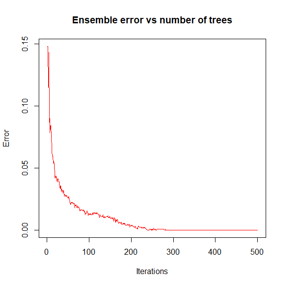
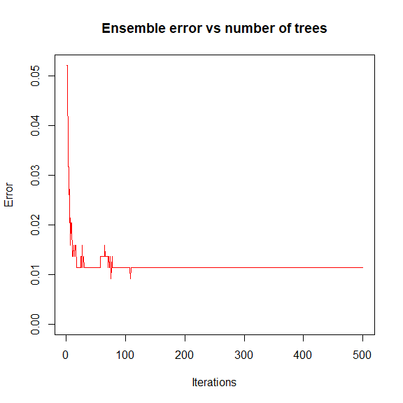
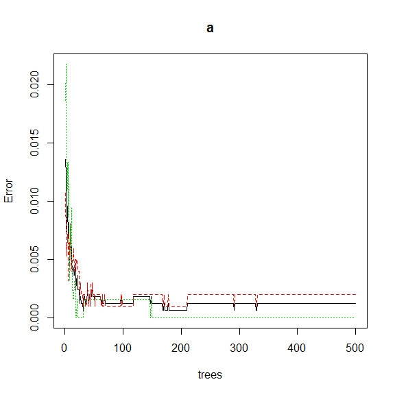
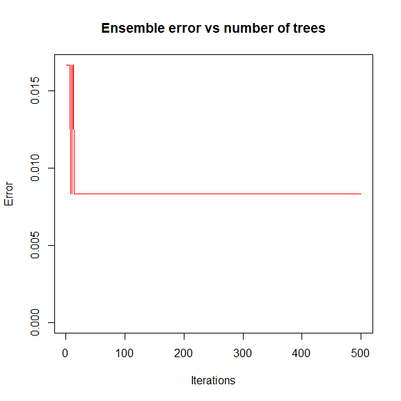

STAT406 - Lecture 18 notes
================
Matias Salibian-Barrera
2017-11-05

LICENSE
-------

These notes are released under the "Creative Commons Attribution-ShareAlike 4.0 International" license. See the **human-readable version** [here](https://creativecommons.org/licenses/by-sa/4.0/) and the **real thing** [here](https://creativecommons.org/licenses/by-sa/4.0/legalcode).

Lecture slides
--------------

The lecture slides are [here](STAT406-17-lecture-18-preliminary.pdf).

Boosting (a Statistical Learning perspective)
=============================================

In these notes we will discuss boosting starting from one its first incarnations (adaboost.m1). Our goal here is two-fold: introduce boosting as a **different** way of building an **ensemble** of *weak classifiers*, and also to show how a statistical analysis of the method offers valuable insight and also opens a wide range of extensions and new methodologies. We follow the presentation in Chapter 10 of \[HTF09\].

#### A different ensemble

So far in this course we have seen ensembles of classifiers (or regression estimators) based on the idea of bagging: combininig the predictions of a number of predictors trained on bootstrap samples taken from the original training set. By construction all the predictors in the ensemble are treated *equally* (e.g. their predictions receive the same weight when they are combined). Another characteristic of these ensembles is the predictors in them could be trained in parallel (they are independent from each other).

#### A different ensemble

Boosting algorithms go back to the late 90s. One of the first ones to appear in the Machine Learning literature is probably *Adaboost.M1* introduced in

> Freund, Y. and Schapire, R. (1997). A decision-theoretic generalization of online learning and an application to boosting, *Journal of Computer and System Sciences*, **55**:119-139.

We discussed the specifics of the algorithm in class. An important difference with other ensembles is that for *Adaboost.M1* the elements of the ensemble are trained *sequentially* in such a way that to compute the i-th predictor *T*<sub>*i*</sub> we need to have the previous one *T*<sub>*i* − 1</sub> available. Furthemore, their associated weights in the final combination of predictions are generally different for each member of the ensemble.

The zip code digits example. Look at 7 vs 9. Basic classifiers two-split trees. Error rate evolution on the training set.

``` r
data(zip.train, package='ElemStatLearn')
x.tr <- data.frame(zip.train)
names( x.tr  ) <- paste('V', 1:257, sep='')
x.tr <- x.tr[ x.tr$V1 %in% c(7, 9), ]
x.tr$V1 <- as.factor(x.tr$V1)
library(adabag)
onesplit <- rpart.control(cp=-1, maxdepth=1, minsplit=0, xval=0)
bo1 <- boosting(V1 ~ ., data=x.tr, boos=FALSE, mfinal=500, control=onesplit)
# table(x.tr$V1, predict(bo1, newdata=x.tr)$class)
plot(errorevol(bo1, newdata=x.tr))
```



Check performance on test set. Including error rate evolution on test set.

``` r
data(zip.test, package='ElemStatLearn')
x.te <- data.frame(zip.test)
names( x.te ) <- paste('V', 1:257, sep='')
x.te <- x.te[ x.te$V1 %in% c(7, 9), ]
x.te$V1 <- as.factor(x.te$V1)
table(x.te$V1, predict(bo1, newdata=x.te)$class)
```

    ##    
    ##       7   9
    ##   7 140   7
    ##   9   4 173

``` r
plot(errorevol(bo1, newdata=x.te))
```



Now compare with a Random Forest (same number of elements in the ensemble). Look at evolution of the forest. What are the two different collections of "fitted values" on the training set? Check performance on test set.

``` r
library(randomForest)
a <- randomForest(V1 ~ . , data=x.tr, ntree=500)
plot(a)
```



``` r
table(x.tr$V1, predict(a, newdata=x.tr, type='response'))
```

    ##    
    ##       7   9
    ##   7 645   0
    ##   9   0 644

``` r
table(x.tr$V1, predict(a, type='response'))
```

    ##    
    ##       7   9
    ##   7 625  20
    ##   9   7 637

``` r
pr.rf <- predict(a, newdata=x.te, type='response')
table(x.te$V1, pr.rf)
```

    ##    pr.rf
    ##       7   9
    ##   7 141   6
    ##   9   0 177

<!-- xtr <- read.table('c:/Users/Matias/Desktop/STAT406/2017-18/lecture16/isolet-train.data', header=FALSE, sep=',') -->
<!-- xte <- read.table('c:/Users/Matias/Desktop/STAT406/2017-18/lecture16/isolet-test.data', header=FALSE, sep=',') -->
<!-- xtr.ah <- xtr[ xtr$V618 %in% c(1, 8), ] -->
<!-- xte.ah <- xte[ xte$V618 %in% c(1, 8), ] -->
<!-- write.table(xtr.ah, file='isolet-train-a-h.data', row.names=FALSE, col.names=TRUE, sep=',', quote=FALSE) -->
<!-- write.table(xte.ah, file='isolet-test-a-h.data', row.names=FALSE, col.names=TRUE, sep=',', quote=FALSE) -->
<!-- xtr.mn <- xtr[ xtr$V618 %in% c(13, 14), ] -->
<!-- xte.mn <- xte[ xte$V618 %in% c(13, 14), ] -->
<!-- write.table(xtr.mn, file='isolet-train-m-n.data', row.names=FALSE, col.names=TRUE, sep=',', quote=FALSE) -->
<!-- write.table(xte.mn, file='isolet-test-m-n.data', row.names=FALSE, col.names=TRUE, sep=',', quote=FALSE) -->
Another example: ISOLET. Letters A vs H.

``` r
xtr <- read.table('isolet-train-a-h.data', sep=',', header=TRUE)
xte <- read.table('isolet-test-a-h.data', sep=',', header=TRUE) 
xtr$V618 <- as.factor(xtr$V618)
xte$V618 <- as.factor(xte$V618)
set.seed(123)
a.rf <- randomForest(V618 ~ ., data=xtr, ntree=500) 
p.rf <- predict(a.rf, newdata=xte, type='response')
table(xte$V618, p.rf)
```

    ##    p.rf
    ##      1  8
    ##   1 58  2
    ##   8  0 60

``` r
onesplit <- rpart.control(cp=-1, maxdepth=1, minsplit=0, xval=0)
bo1 <- boosting(V618 ~ ., data=xtr, boos=FALSE, mfinal=500, control=onesplit)
# twosplits <- rpart.control(cp=-1, maxdepth=2, minsplit=0, xval=0)
# bo2 <- boosting(V618 ~ ., data=xtr, boos=FALSE, mfinal=500, control=twosplits)
table(xte$V618, predict(bo1, newdata=xte)$class)
```

    ##    
    ##      1  8
    ##   1 59  1
    ##   8  0 60

``` r
# table(xte$V618, predict(bo2, newdata=xte)$class)
plot(errorevol(bo1, newdata=xte))
```



``` r
# plot(errorevol(bo2, newdata=xte))
```

#### What is Adaboost really doing?

We have seen in class that Adaboost can be thought of as fitting an *additive model* in a stepwise (greedy) way, using an exponential loss. Knowing what optimization problem the boosting algorithms are solving lets us find out what is the classifier that boosting is approximating. This insight allows us to understand when the algorithm is expected to work well, and also when it can be expected to not work well (refer to the corresponding lab activity). In particular, it provides one way to choose the complexity of the *weak lerners* used to construct the ensemble.

Gradient boosting
-----------------
