STAT406 - Lecture 21 notes
================
Matias Salibian-Barrera
2017-11-13

LICENSE
-------

These notes are released under the "Creative Commons Attribution-ShareAlike 4.0 International" license. See the **human-readable version** [here](https://creativecommons.org/licenses/by-sa/4.0/) and the **real thing** [here](https://creativecommons.org/licenses/by-sa/4.0/legalcode).

Lecture slides
--------------

The lecture slides are [here](STAT406-17-lecture-21-preliminary.pdf).

Model based clustering
----------------------

EM algorithm
------------

Bivariate Gaussian mixture model via EM "by hand"
-------------------------------------------------

We will use a 2-dimensional representation of the UN votes data. This lower-dimensional representation is obtained using multidimensional scaling, a topic we will cover later in the module.

This is the data with which we will work: 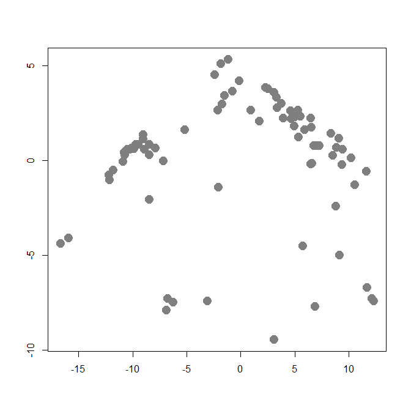

We will now use the EM algorithm to find (Gaussian-ly distributed) clusters in the data. First we find initial maximum likelihood estimators (i.e. initial values for the EM algorithm), using a random partition of the data:

Note that the above loop could have been computed more efficiently using the fact that at the initial step the gamma coefficients are either 0's or 1's. However, in the following steps of the EM algorithm we will need to use such *weighted averages* computations, since in general the weights are between 0 and 1.

This is the initial configuration (pure noise):

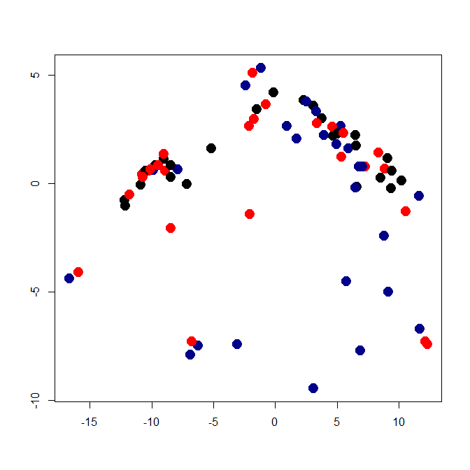

We now launch our iterations. Here I run 120 iterations. Can you think of an appropriate convergence criterion? Should we look at the parameter estimates, the gammas (posterior class probabilities), the likelihood function?

We now plot the estimated density for X, which is a combination of 3 gaussian densities. We do this by evaluating the estimated densities on a relatively fine grid of points and displaying them. We will color the points according to the estimated group labels (the largest estimated posterior probability for each point). We first compute those

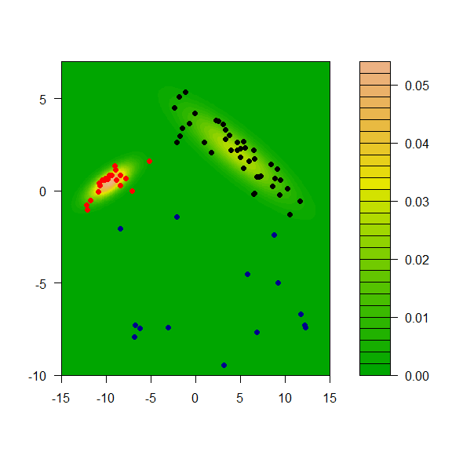

We can also show each separate estimated component:

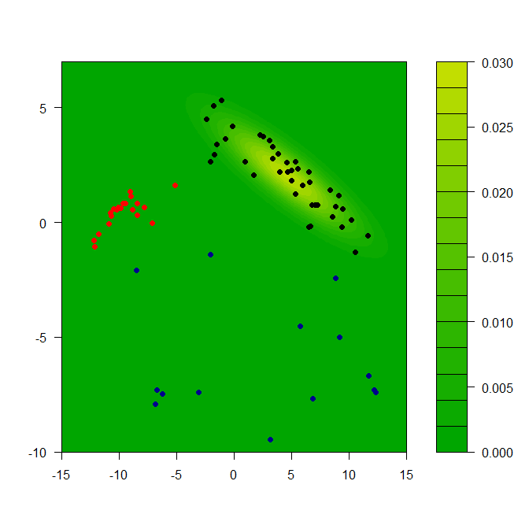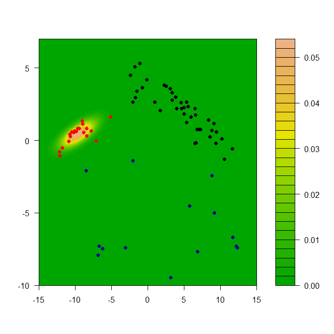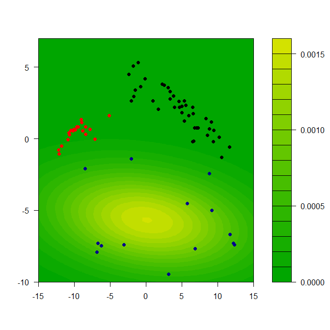

Model assumptions may be important
----------------------------------

We will illustrate the problem with a synthetic data set. There are 3 groups with 300 observations in each, and 3 variables / features.

This is how the data look

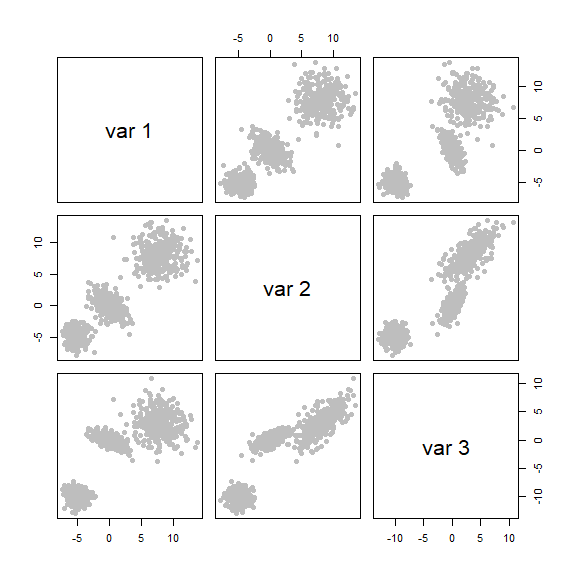

It is not a surprise that model-based clustering works very well in this case:

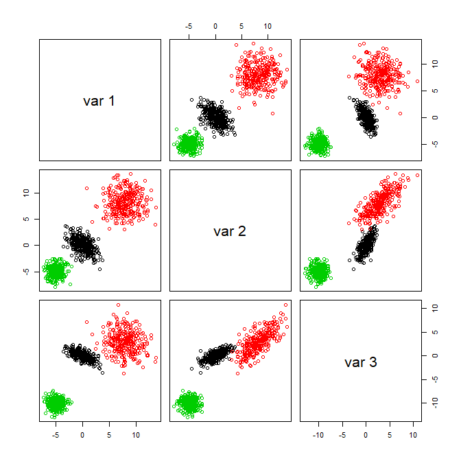

We now create a data set that does not satisfy the model:

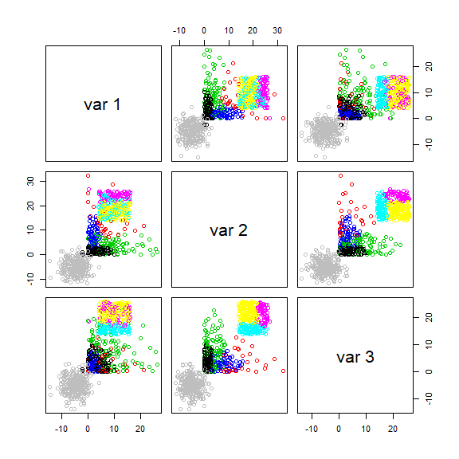

The problem is with the likelihood-based criterion used by `mclust()` to select the number of clusters. Note that the function increases until k = 3, and it almost stops growing after k = 4. The the maximum is nonetheless attained at k = 8.

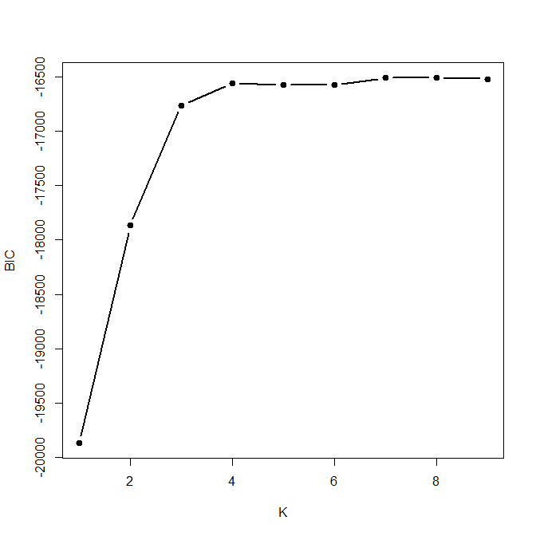

It is interesting to note that K-means would have found the right number of clusters and cluster memberships rather easily. Here is the sum-of-squares plot based on K-means, which indicates that K = 3 is a sensible choice:

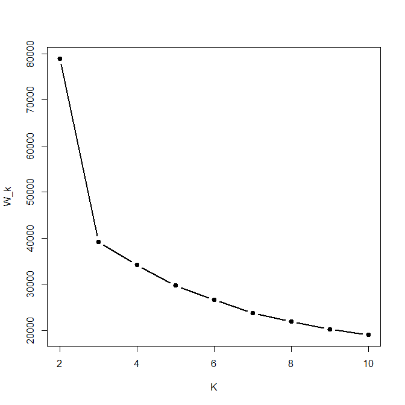

The clusters found when K-means was run with kK = 3 were:

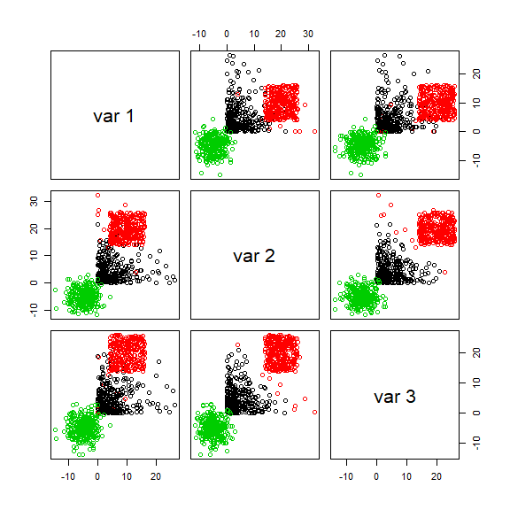

Furthermore, if you force `mclust()` to use 3 classes it works fairly well, even thought the model is wrong. The main problem here is that BIC depends heavily on the assumed likelihood / probabilistic model:

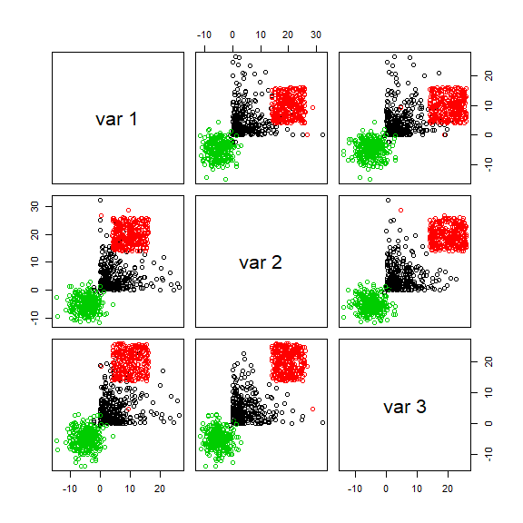

Behaviour when there are noise variables
----------------------------------------

The presence of noise variables (i.e. features that are non-informative about clusters that may be present in the data) can be quite damaging to these methods (both K-means and mclust) We will create two data sets with "noise" features: one with Gaussian noise, and one with uniformly distributed noise.

We now find clusters using a Gaussian model, and select the number of clusters using likelihood-base criterion:

If we use the first 3 features (which are the ones that determine the cluster structure) to show the clusters found by `mclust` when the noise was not Gaussian, we get:

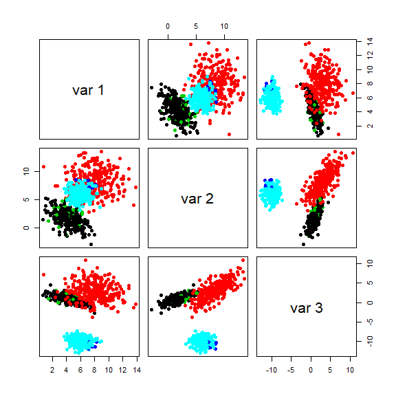

And even when the noise had a Gaussian distribution, we do not identify the \`\`right'' clusters:

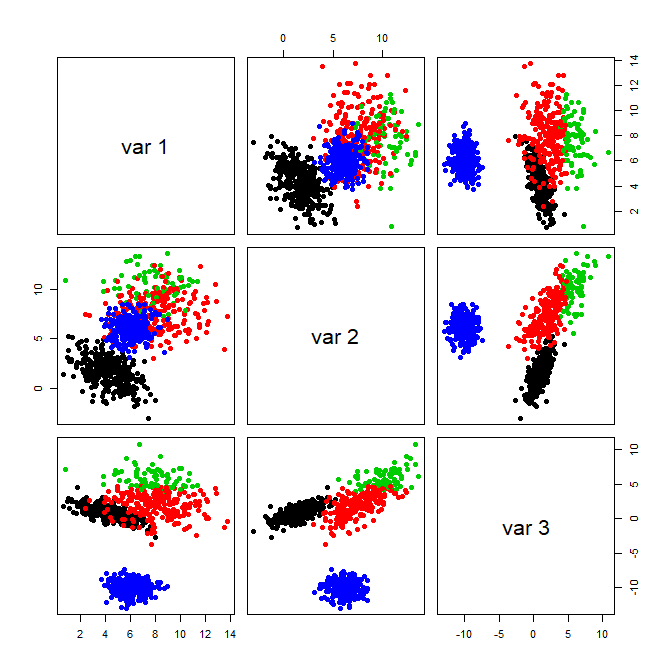

If we force `mclust()` to identify 3 clusters, things look much better both for Gaussian and non-Gaussian noise:

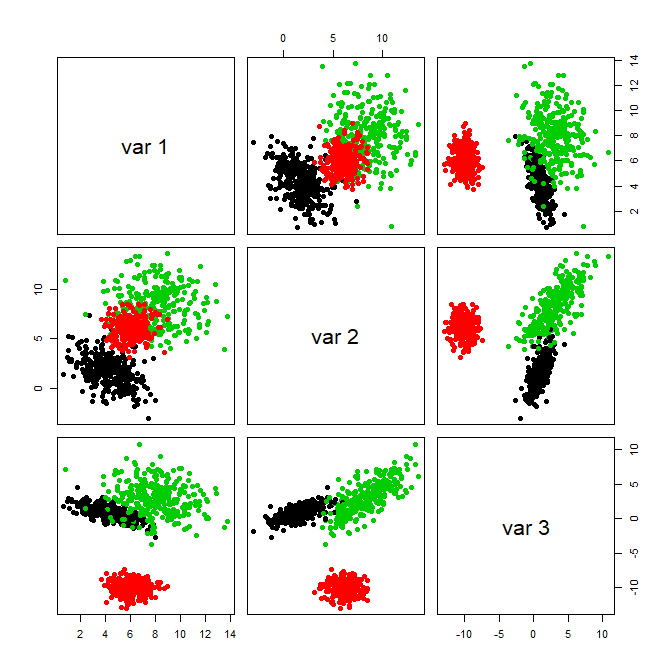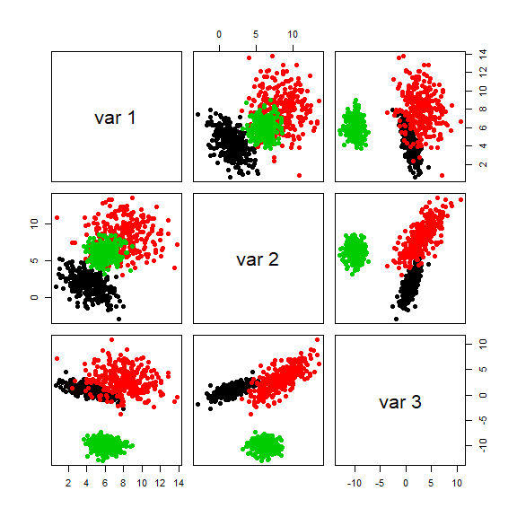

Note that noise also affects K-means seriously. I refer you to the robust and sparse K-means method (links on the module's main page).

Within sum-of-squares plot for K-means with non-Gaussian noise:

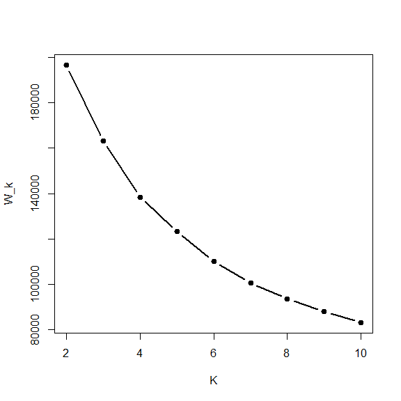

Within sum-of-squares plot for K-means with Gaussian noise:

Not even forcing `k-means` to identify 3 clusters helps when there are noise features:

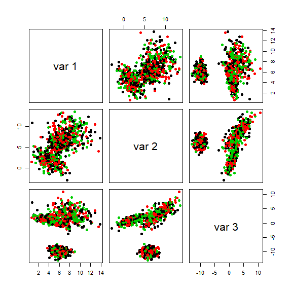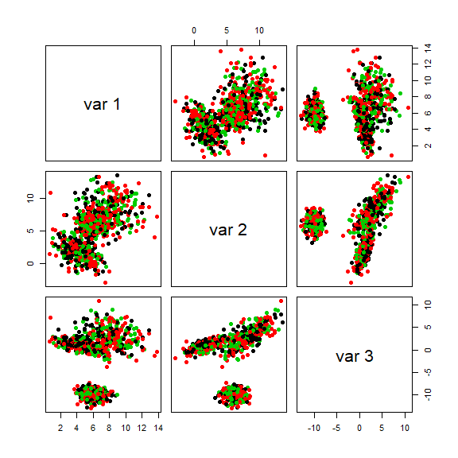
