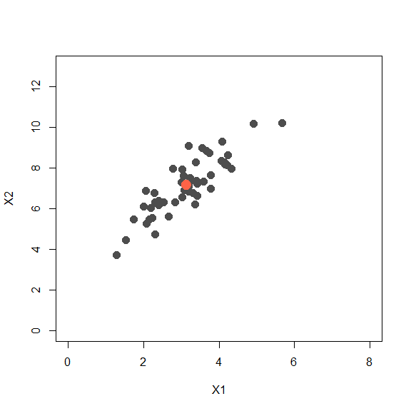
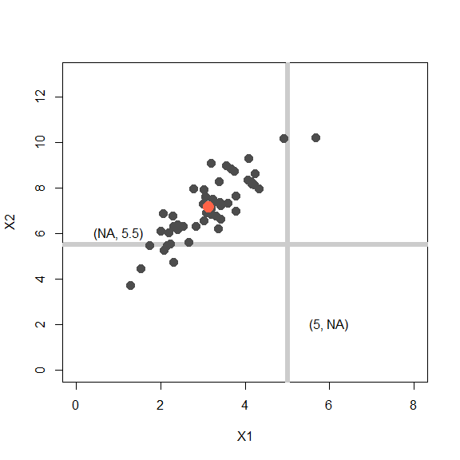
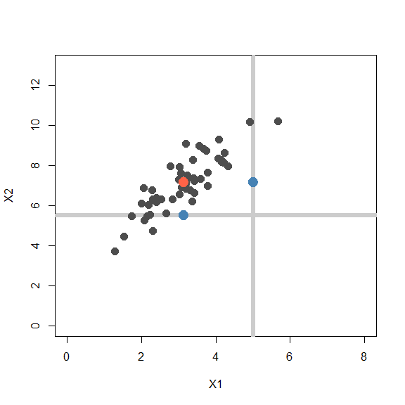

STAT406 - Lecture 22 notes
================
Matias Salibian-Barrera
2017-11-21

LICENSE
-------

These notes are released under the "Creative Commons Attribution-ShareAlike 4.0 International" license. See the **human-readable version** [here](https://creativecommons.org/licenses/by-sa/4.0/) and the **real thing** [here](https://creativecommons.org/licenses/by-sa/4.0/legalcode).

Lecture slides
--------------

The lecture slides are [here](STAT406-17-lecture-22.pdf).

Imputation via EM (a detailed example "by hand")
------------------------------------------------

Missing data is a rather prevalent problem, and different strategies to replace them by sensible "predictions" exit. They are collectively called "imputation methods". In these notes we will follow the missing data example discussed in class and use the EM algorithm to impute partially unobserved data points in a synthetic bivariate Gaussian data set. Furthemore, the scripts below are designed for the case where only one entry may be missing in each observation. It is not difficult to extend this to data with more coordinates and more than one entry missing. Please refer to your class notes for formulas and details.

#### A synthetic example

To illustrate the method in a simple setting where we can visualize the ideas on a 2-dimensional scatter plot, we will work with a *toy* example. We first create a simple synthetic data set with 50 observations in 2 dimensions, normally distributed with center at the point (3,7), and a fairly strong correlation between its two coordinates:

``` r
library(mvtnorm)
# mean vector
mu <- c(3, 7)
# variance/covariance matrix
si <- matrix(c(1, 1.2, 1.2, 2), 2, 2)
# generate data
set.seed(123)
x <- rmvnorm(50, mean = mu, sigma = si)
```

This is the data. The larger red point indicates the sample mean (3.13, 7.15):



Assume we have an observation (5, **NA**) where the second coordinate is missing, and another one (**NA**, 5.5) with the first coordinate missing. We indicate them with grey lines to indicate the uncertainty about their missing entries:



A simple method to impute the missing coordinates would be to replace them by the mean of the missing variable over the rest of the data. Hence (5, **NA**) becomes (5, *7.15*) and (**NA**, 5.5) becomes (*3.13*, 5.5). The imputed points are shown below as blue dots:



Note that the imputed points are in fact away from the bulk of the data, even though this is not apparent if you look at each coordinate separately. A better imputation method uses the EM algorithm.

We assume that the points in our data can be modelled as occurences of a bivariate random vector with a normal / Gaussian distribution. The unknown parameters are its mean vector and 2x2 variance/covariance matrix. The EM algorithm will alternate between computing the expected value of the log-likelihood for the full (non-missing) data set conditional on the actually observed points (even incompletely observed ones), and finding the parameters (mean vector and covariance matrix) that maximize this conditional expected log-likelihood.

It is not trivial to see that the conditional expected log-likelihood equals a constant (that depends only on the parameters from the previous iteration) plus the log-likelihood of a data set where the missing coordinates of each observation are replaced by their conditional expectation (given the observed entries in the same unit). Refer to the discussion in class for more details.

We now implement this imputation method in `R`. First add the two incomplete observations to the data set above, we append them at the "bottom" of the matrix `x`:

``` r
set.seed(123)
dat <- rbind(x, c(5, NA), c(NA, 5.5))
```

Next, we compute initial values / estimates for the parameters of the model. These can be, for example, the sample mean and sample covariance matrix using only the fully observed data points:

``` r
mu <- colMeans(dat, na.rm = TRUE)
si <- var(dat, na.rm = TRUE)
```

Before we start the EM iterations it will be helpful to keep track of wich observations are missing a coordinate (we store their indices in the vector `mi`):

``` r
n <- nrow(dat)
p <- 2
# find observations with a missing coordinate
mi <- (1:n)[!complete.cases(dat)]
```

Out of the n (52) rows in `x`, the ones with some missing coordinates are: 51, 52.

Now we run 100 iterations of the EM algorithm, although convergence is achieved much sooner:

``` r
# For this data we don't need many iterations
niter <- 100
# how many observations with missing entries:
len.mi <- length(mi)
# Start the EM iterations
for (i in 1:niter) {
    # E step impute the data points with missing entries
    for (h in 1:len.mi) {
        # which entries are not missing?
        nm <- !is.na(dat[mi[h], ])
        dat[mi[h], !nm] <- mu[!nm] + si[!nm, nm] * solve(si[nm, nm], dat[mi[h], 
            nm] - mu[nm])
    }
    # M step, luckily we have a closed form for the maximizers of the
    # conditional expected likelihood
    mu <- colMeans(dat)
    si <- var(dat)
}
```

The imputed data are now much more in line with the shape and distribution of the other points in the data set:


