STAT406 - Lecture 25 notes
================
Matias Salibian-Barrera
2017-11-30

LICENSE
-------

These notes are released under the "Creative Commons Attribution-ShareAlike 4.0 International" license. See the **human-readable version** [here](https://creativecommons.org/licenses/by-sa/4.0/) and the **real thing** [here](https://creativecommons.org/licenses/by-sa/4.0/legalcode).

Lecture slides
--------------

The lecture slides are [here](STAT406-17-lecture-25-preliminary.pdf). The course review slides are [here](STAT406-17-review-lecture.pdf).

Multidimensional scaling
------------------------

#### European languages example

We will illustrate it first on the languages example we saw earlier in class. We have a specific dissimilarity measure between 11 european languages (the number of different first letters in their numerals). Recall what we found when use used a hierarchical clustering algorithm:

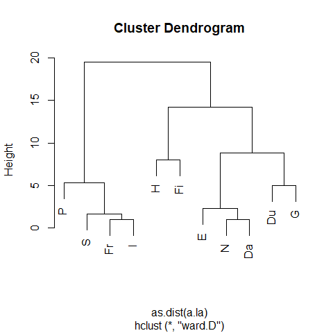

We will now use Classical (Metric) Multidimensional Scaling as implemented in the `R` function `cmdscale` to find a two dimensional representation of these countries that best reflects their pairwise distances

``` r
# a.la <- read.table('languages.dat', header=FALSE) a.la <- a.la + t(a.la)
la.cmds <- cmdscale(a.la, k = 2)
plot(la.cmds, type = "n")
text(la.cmds, labels = la.nms)
```

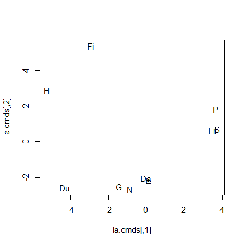

Note that the 2-dimensional representation above does not match very well what the hierarchical clustering dendongram suggests (e.g. **N** appears closer to **G** than to **Da**, **E** appears closer to **Da** than **N**, etc.) We now try using the more flexible isotonic (non-metric method) as implemented in the function `isoMDS` of package `MASS`:

``` r
la.iso <- MASS::isoMDS(as.matrix(a.la), k = 2, maxit = 500, tol = 1e-06)
```

    ## initial  value 12.139705 
    ## iter   5 value 5.607213
    ## iter  10 value 4.453054
    ## iter  15 value 4.378991
    ## iter  20 value 4.370529
    ## iter  25 value 4.370016
    ## iter  25 value 4.370014
    ## iter  25 value 4.370014
    ## final  value 4.370014 
    ## converged

``` r
plot(la.iso$points, type = "n")
text(la.iso$points, labels = la.nms)
```

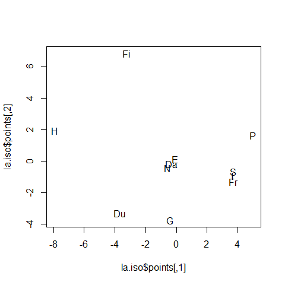

This representation matches more closely what we found with the hierarchical clustering analysis, and seems intuitively better.

We can now try ISOMAP, which is implemented in the function `isomap` in the `vegan` package for `R`:

``` r
library(vegan)
a <- isomap(a.la, ndim = 2, k = 3)
plot(a, type = "points", net = TRUE)
text(a$points, labels = la.nms, pos = 3, offset = 0.3)
```

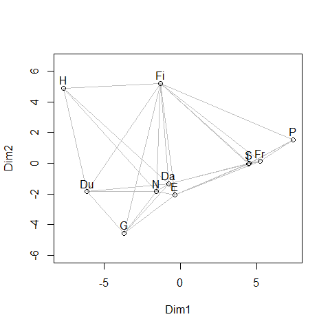

Note that the ISOMAP result is very close to the `isoMDS` solution.

#### UN votes example

We now apply these dimension-reduction methods to the UN votes data. First use the classical / metric MDS approach to find a lower-dimensional representation of the countries in such a way that the pairwise distances are roughly preserved (to the extent that it is possible):

``` r
X <- read.table(file = "../Lecture20/unvotes.csv", sep = ",", row.names = 1, 
    header = TRUE)
X2 <- X[complete.cases(X), ]
dd <- dist(t(X2))
tmp <- cmdscale(dd, k = 2)
```

The result is:

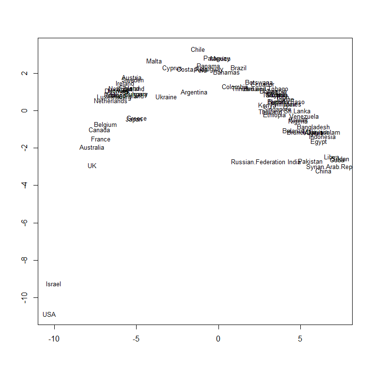

Using ISOMAP we get:

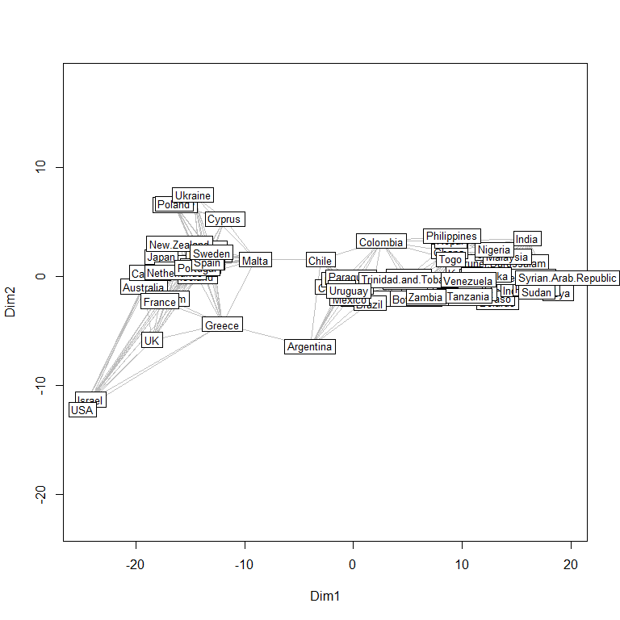

#### Digits example (using Euclidean distances)

Recall the digitized hand-written "3"s example:

``` r
a <- read.table("../Lecture24/train.3.txt", header = FALSE, sep = ",")
```

There are 658 images, each of them represented on a grid of 16x16 pixels (the data are pixel intensities scaled to be between -1 and 1).

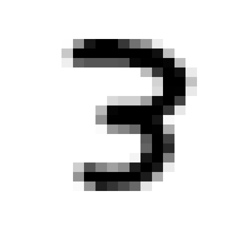

We now use ISOMAP to find a 2-dimensional representation, and use it to explore these images

``` r
dd <- dist(a)
# dd <- 1-abs(cor(t(a)))
a.iso <- isomap(dd, ndim = 2, k = 5)
plot(a.iso, type = "points", net = TRUE)
```


We now "walk" along the manifold in different directions and can look at the corresponding images. The points were identified interactively using the function `identify` in `R`:

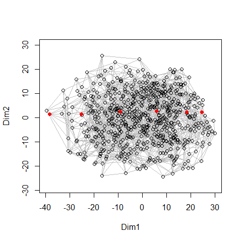

We now overlay the corresponding images

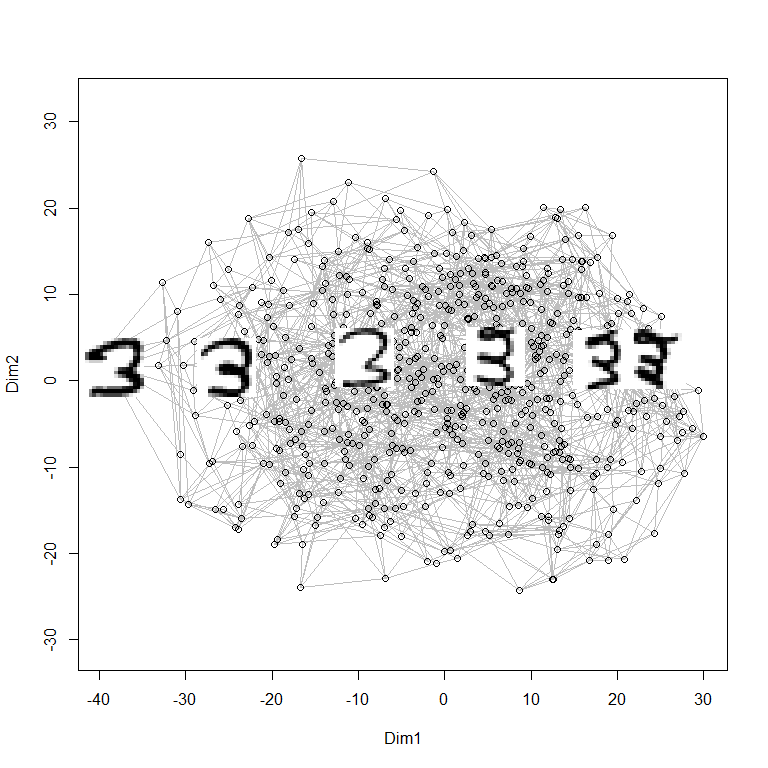

We now do the same along a different line

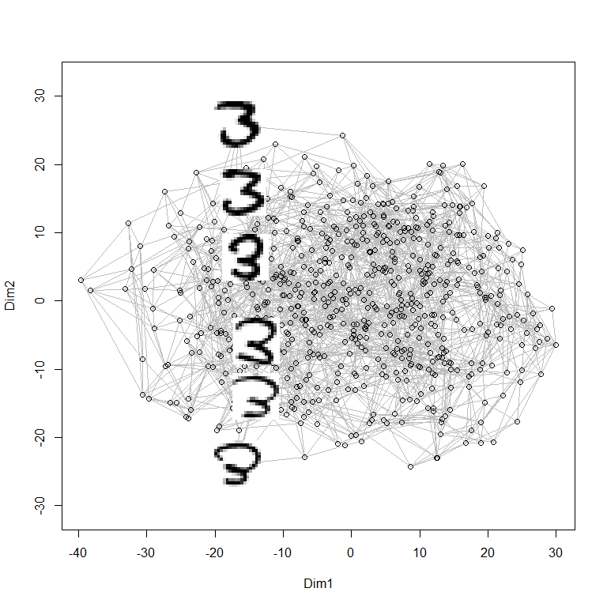

#### Digits example (using correlation-based dissimilarities)

The above exploratory experiment wasn't as successful as the one we did based on principal components. Below we repeat it using a different dissimilarity measure between images, in the hope of finding a more interesting pattern in the data.

Another dissimilarity measure that can be used is based on correlations. Specifically we define the dissimilarity d(**a**, **b**) between points **a** and **b** as d(**a**, **b**) = 1 - abs(cor(a, b)), so that d(**a**, **b**) = 0 when **a** and **b** are perfectly linearly correlated, an d(**a**, **b**) is maximal when there is no linear correlation between the entries (elements) of **a** and **b**.

We will re-do the ISOMAP analysis above on the hand-written digits, but using this dissimilarity measure. Since images are stored row-wise in the matrix `a` in the `R` code above, to compute the "correlations" between them I will use the function `cor` but applied to the transposed data matrix:

``` r
dd <- 1 - abs(cor(t(a)))
a.iso <- isomap(dd, ndim = 2, k = 5)
plot(a.iso, type = "points", net = TRUE)
```

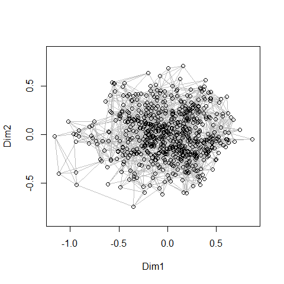

We again use the function `identify` to select a few images to reveal along different paths:

``` r
plot(a.iso, type = "points", net = TRUE)
# sp <- identify(a.iso$points)
sp <- c(9, 46, 101, 330, 343, 381, 396, 626)
for (j in sp) {
    im <- matrix(unlist(a[j, ]), 16, 16)
    add.image(a.iso$points[j, 1], a.iso$points[j, 2], im, image.width = 0.1, 
        col = grey(seq(1, 0, length = 256)))
}
```

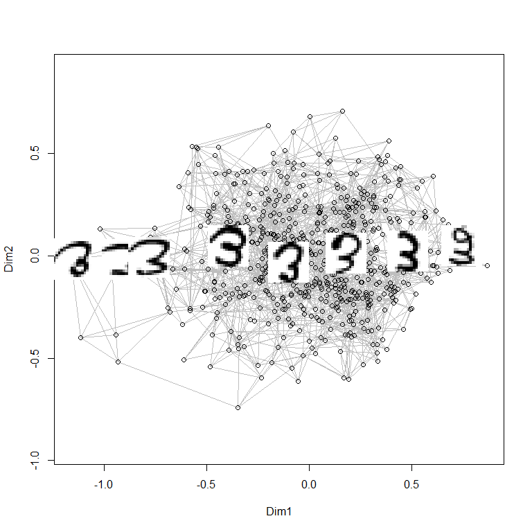

``` r
plot(a.iso, type = "points", net = TRUE)
# sp <- identify(a.iso$points)
sp <- c(51, 99, 104, 155, 336, 400, 438, 521)
for (j in sp) {
    im <- matrix(unlist(a[j, ]), 16, 16)
    add.image(a.iso$points[j, 1], a.iso$points[j, 2], im, image.width = 0.1, 
        col = grey(seq(1, 0, length = 256)))
}
```


Unfortunately no easily interpretable pattern is apparent either.
