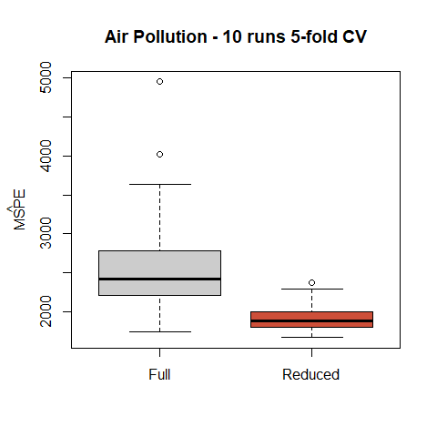

STAT406 - Lecture 3 notes
================
Matias Salibian-Barrera
2017-08-23

Lecture slides
--------------

The lecture slides are [here](STAT406-17-lecture-3.pdf).

Cross-validation
----------------

Load the data

``` r
data <- read.csv('../Lecture1/rutgers-lib-30861_CSV-1.csv')
m.f <- lm(MORT ~ . , data=data)
m.r <- lm(MORT ~ POOR + HC + NOX + HOUS + NONW, data=data)
```

We use 10 runs of 5-fold CV comparing the full and reduced models. Again, here we assume that the reduced model was not obtained using the training data.

``` r
N <- 100
mspe1 <- mspe2 <- vector('double', N)
ii <- (1:(n <- nrow(data))) %% 5 + 1
set.seed(327)
for(i in 1:N) {
  ii <- sample(ii)
  pr.f <- pr.r <- vector('double', n)
  for(j in 1:5) {
    pr.f[ ii == j ] <- predict(update(m.f, data=data[ii != j, ]), newdata=data[ii==j,])
    pr.r[ ii == j ] <- predict(update(m.r, data=data[ii != j, ]), newdata=data[ii==j,])
  }
  mspe1[i] <- with(data, mean( (MORT - pr.f)^2 ))
  mspe2[i] <- with(data, mean( (MORT - pr.r)^2 ))
}  
boxplot(mspe1, mspe2, names=c('Full', 'Reduced'), 
        col=c('gray80', 'tomato3'), 
        main='Air Pollution - 10 runs 5-fold CV')
mtext(expression(hat(MSPE)), side=2, line=2.5)
```


