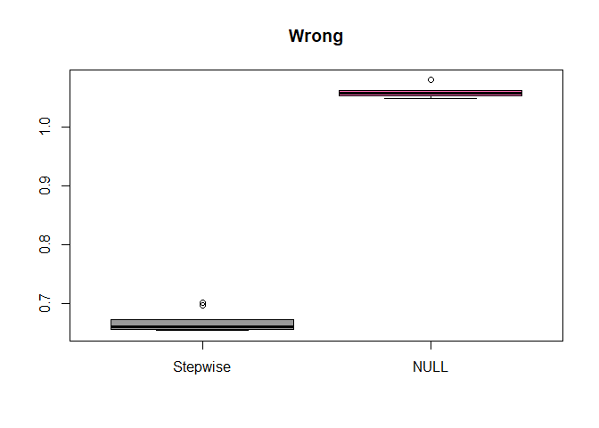

STAT406 - Lecture 3 notes
================
Matias Salibian-Barrera
2017-09-04

Lecture slides
--------------

The lecture slides are [here](STAT406-17-lecture-3.pdf).

Cross-validation when the model is chosen using the data
--------------------------------------------------------

In this document we study how to perform cross-validation when the model was selected or determined using the training data. Consider the following synthetic data set

``` r
dat <- read.table('fallacy.dat', header=TRUE, sep=',')
```

This is the same data used in class. In this example we know what is the "true" model, and thus we also know what is the "optimal" predictor we should train using this data.

However, we now decide to build a good linear model using forward stepwise (AIC-based):

``` r
library(MASS)
p <- ncol(dat)
null <- lm(Y~1, data=dat)
full <- lm(Y~., data=dat) # needed for stepwise
step.lm <- stepAIC(null, scope=list(lower=null, upper=full), trace=FALSE)
```

Without thinking, we use CV to compare the MSPE of the **null** model (which we know is "true") and the one we obtained using forward stepwise:

``` r
n <- nrow(dat)
ii <- (1:n) %% 5 + 1
set.seed(17)
N <- 10
mspe.n <- mspe.st <- rep(0, N)
for(i in 1:N) {
  ii <- sample(ii)
  pr.n <- pr.st <- rep(0, n)
  for(j in 1:5) {
    tmp.st <- update(step.lm, data=dat[ii != j, ])
    pr.st[ ii == j ] <- predict(tmp.st, newdata=dat[ii == j, ])
    pr.n[ ii == j ] <- with(dat[ii != j, ], mean(Y))
  }
  mspe.st[i] <- with(dat, mean( (Y - pr.st)^2 ))
  mspe.n[i] <- with(dat, mean( (Y - pr.n)^2 ))
}
boxplot(mspe.st, mspe.n, names=c('Stepwise', 'NULL'), col=c('gray60', 'hotpink'), main='Wrong')
```



``` r
summary(mspe.st)
```

    ##    Min. 1st Qu.  Median    Mean 3rd Qu.    Max. 
    ##  0.6533  0.6557  0.6600  0.6675  0.6700  0.7015

``` r
summary(mspe.n)
```

    ##    Min. 1st Qu.  Median    Mean 3rd Qu.    Max. 
    ##   1.047   1.052   1.058   1.058   1.061   1.079

-   **Something is wrong!** Why?
-   What would you change above to obtain reliable estimates for the MSPE of the model selected with the stepwise approach?

Correlated covariates
---------------------

Variables that are significant in a smaller model, "dissappear" in a larger one

``` r
# Correlated covariates
x <- read.table('../Lecture1/rutgers-lib-30861_CSV-1.csv', header=TRUE, sep=',')
reduced <- lm(MORT ~ POOR + HC + NOX + HOUS + NONW, data=x)
full <- lm(MORT ~ ., data=x)
# significant variables in "reduced" dissappear in "full"
round( summary(reduced)$coef, 3)
```

    ##             Estimate Std. Error t value Pr(>|t|)
    ## (Intercept) 1172.831    143.241   8.188    0.000
    ## POOR          -4.065      2.238  -1.817    0.075
    ## HC            -1.480      0.333  -4.447    0.000
    ## NOX            2.846      0.652   4.369    0.000
    ## HOUS          -2.911      1.533  -1.899    0.063
    ## NONW           4.470      0.846   5.283    0.000

``` r
round( summary(full)$coef[ names(coef(reduced)), ], 3)
```

    ##             Estimate Std. Error t value Pr(>|t|)
    ## (Intercept) 1763.981    437.327   4.034    0.000
    ## POOR          -0.168      3.227  -0.052    0.959
    ## HC            -0.672      0.491  -1.369    0.178
    ## NOX            1.340      1.006   1.333    0.190
    ## HOUS          -0.651      1.768  -0.368    0.714
    ## NONW           4.460      1.327   3.360    0.002
