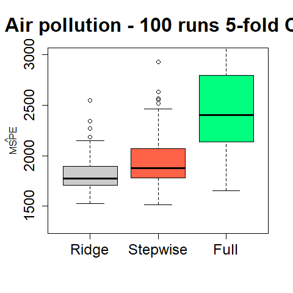

STAT406 - Lecture 5 notes
================
Matias Salibian-Barrera
2017-09-15

Lecture slides
--------------

The lecture slides are [here](STAT406-17-lecture-5-preliminary.pdf).

Ridge regression
----------------

We use Ridge Regression with the air pollution data to obtain a more stable predictor.

``` r
airp <- read.table('../lecture1/rutgers-lib-30861_CSV-1.csv', header=TRUE, sep=',')
library(glmnet)
# alpha = 0 - Ridge
# alpha = 1 - LASSO
y <- as.vector(airp$MORT)
xm <- as.matrix(airp[, -16])
lambdas <- exp( seq(-3, 10, length=50))
a <- glmnet(x=xm, y=y, lambda=rev(lambdas),
            family='gaussian', alpha=0)
plot(a, xvar='lambda', label=TRUE, lwd=6, cex.axis=1.5, cex.lab=1.2, ylim=c(-20, 20))
```


5-fold CV

``` r
# run 5-fold CV
set.seed(123)
tmp <- cv.glmnet(x=xm, y=y, lambda=lambdas, nfolds=5, alpha=0, family='gaussian')
plot(tmp, lwd=6, cex.axis=1.5, cex.lab=1.2)
```


5-fold CV again

``` r
set.seed(23)
tmp <- cv.glmnet(x=xm, y=y, lambda=lambdas, nfolds=5, alpha=0, family='gaussian')
plot(tmp, lwd=6, cex.axis=1.5, cex.lab=1.2)
```


What is the optimal lambda?. Average over several runs?

``` r
set.seed(123)
op.la <- 0
for(j in 1:20) {
  tmp <- cv.glmnet(x=xm, y=y, lambda=lambdas, nfolds=5, alpha=0, family='gaussian')
  op.la <- op.la + tmp$lambda.min # tmp$lambda.1se
}
(op.la <- op.la / 20)
```

    ## [1] 10.39156

``` r
log(op.la)
```

    ## [1] 2.340994

Effective degrees of freedom

``` r
# compute EDF
xm.svd <- svd(xm) #  scale(xm, scale=FALSE))
(est.edf <- sum( xm.svd$d^2 / ( xm.svd$d^2 + op.la ) ))
```

    ## [1] 13.15941

Compare the MSPE of the different models

``` r
library(MASS)
n <- nrow(xm)
k <- 5
ii <- (1:n) %% k + 1
set.seed(123)
N <- 100
mspe.st <- mspe.ri <- mspe.f <- rep(0, N)
for(i in 1:N) {
  ii <- sample(ii)
  pr.f <- pr.ri <- pr.st <- rep(0, n)
  for(j in 1:k) {
    tmp.ri <- cv.glmnet(x=xm[ii != j, ], y=y[ii != j], lambda=lambdas,
                        nfolds=5, alpha=0, family='gaussian')
    null <- lm(MORT ~ 1, data=airp[ii != j, ])
    full <- lm(MORT ~ ., data=airp[ii != j, ])
    tmp.st <- stepAIC(null, scope=list(lower=null, upper=full), trace=0)
    pr.ri[ ii == j ] <- predict(tmp.ri, s='lambda.min', newx=xm[ii==j,])
    pr.st[ ii == j ] <- predict(tmp.st, newdata=airp[ii==j,])
    pr.f[ ii == j ] <- predict(full, newdata=airp[ii==j,])
  }
  mspe.ri[i] <- mean( (airp$MORT - pr.ri)^2 )
  mspe.st[i] <- mean( (airp$MORT - pr.st)^2 )
  mspe.f[i] <- mean( (airp$MORT - pr.f)^2 )
}
boxplot(mspe.ri, mspe.st, mspe.f, names=c('Ridge', 'Stepwise', 'Full'), 
        col=c('gray80', 'tomato', 'springgreen'), cex.axis=1.5, cex.lab=1.5, 
        main='Credit - 10 runs 5-fold CV', cex.main=2, ylim=c(1300, 3000))
mtext(expression(hat(MSPE)), side=2, line=2.5)
```


