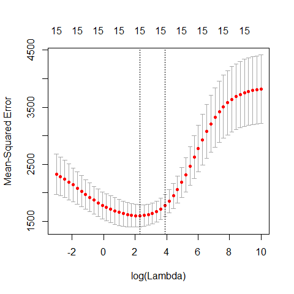
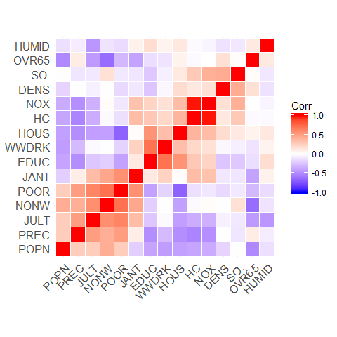

STAT406 - Lecture 7 notes
================
Matias Salibian-Barrera
2017-09-24

Lecture slides
--------------

The lecture slides are [here](STAT406-17-lecture-7-preliminary.pdf).

Comparing LASSO with Ridge Regression on the air pollution data
---------------------------------------------------------------

Let us compare the Ridge Regression and LASSO fits to the air pollution data. Of course, by *the Ridge Regression fit* and *the LASSO fit* we mean the fit obtained with the optimal value of the penalty constant chosen in terms of the corresponding estimated MSPE (which is in general estimated using K-fold cross validation).

We first load the data and use `cv.glmnet()` with `alpha = 0` to select an **approximately optimal** Ridge Regression fit (what makes the calculation below **only approximately** optimal?).

``` r
airp <- read.table('../Lecture1/rutgers-lib-30861_CSV-1.csv', header=TRUE, sep=',')
y <- as.vector(airp$MORT)
xm <- as.matrix(airp[, names(airp) != 'MORT'])
library(glmnet)
lambdas <- exp( seq(-3, 10, length=50))
# Ridge Regression
set.seed(23)
air.l2 <- cv.glmnet(x=xm, y=y, lambda=lambdas, nfolds=5, alpha=0, 
                 family='gaussian', intercept=TRUE)
plot(air.l2)
```



The plot above is included for illustration purposes only. Similarly, we now compute an approximately optimal LASSO fit, and look at the curve of estimated MSPEs:

``` r
# LASSO
set.seed(23)
air.l1 <- cv.glmnet(x=xm, y=y, lambda=lambdas, nfolds=5, alpha=1, 
                 family='gaussian', intercept=TRUE)
plot(air.l1)
```


It is interesting to compare the corresponding estimated regression coefficients, so we put them side by side in two columns:

``` r
cbind(round(coef(air.l2, s='lambda.min'), 3),
round(coef(air.l1, s='lambda.min'), 3))
```

    ## 16 x 2 sparse Matrix of class "dgCMatrix"
    ##                    1        1
    ## (Intercept) 1084.916 1100.355
    ## PREC           1.407    1.503
    ## JANT          -0.886   -1.189
    ## JULT          -0.836   -1.247
    ## OVR65         -2.000    .    
    ## POPN           5.977    .    
    ## EDUC          -8.154  -10.510
    ## HOUS          -1.156   -0.503
    ## DENS           0.005    0.004
    ## NONW           2.655    3.979
    ## WWDRK         -0.458   -0.002
    ## POOR           0.725    .    
    ## HC            -0.027    .    
    ## NOX            0.049    .    
    ## SO.            0.232    0.228
    ## HUMID          0.391    .

Note how several of them are relatively similar, but LASSO includes fewer of them. A possible explanation for this is the particular correlation structure among the explanatory variables. More specifically, when groups of correlated covariates are present, LASSO tends to choose only one of them, whereas Ridge Regression will tend to keep all of them. For a formal statement see Lemma 2 of

> Zou, H. and Hastie, T. (2005). Regularization and variable selection via the elastic net. *Journal of the Royal Statistical Society: Series B (Statistical Methodology)*, **67**(2), 301-320. [DOI: 10.1111/j.1467-9868.2005.00503.x](http://dx.doi.org/10.1111/j.1467-9868.2005.00503.x)

It is important to note here that the above observations regarding the Ridge Regression and LASSO fits trained on the air pollution data should be made on a more reliable (more stable, less variable) choice of penalty parameter. For example, we may want to run the above 5-fold CV experiments several times and take the average of the estimated optimal penalty parameters. To simplify the presentation we do not purse this here, but it may be a very good exercise for the reader to do so.

The following heatmap of the pairwise correlations among explanatory variables reveals certain patterns that may be used to explain the difference mentioned above. Note that in this visualization method variables were grouped ("clustered") according to their pairwise correlations in order to improve the interpretability of the plot. We will see later in this course the particular clustering method used here (hierarchical clustering).

``` r
library(ggcorrplot)
ggcorrplot(cor(xm), hc.order = TRUE, outline.col = "white")
```



<!-- # # https://briatte.github.io/ggcorr/ -->
<!-- # source('https://raw.githubusercontent.com/briatte/ggcorr/master/ggcorr.R') -->
<!-- # library(ggplot2) -->
<!-- #  -->
<!-- # ggcorr(xm) -->
<!-- # ggcorr(xm, nbreaks=3) -->
<!-- #  -->
<!-- # ggcorr(xm, geom = "blank", label = TRUE, hjust = 0.75) + -->
<!-- #   geom_point(size = 10, aes(color = coefficient > 0, alpha = abs(coefficient) > 0.5)) + -->
<!-- #   scale_alpha_manual(values = c("TRUE" = 0.25, "FALSE" = 0)) + -->
<!-- #   guides(color = FALSE, alpha = FALSE) -->
Compare MSPE of Ridge and LASSO on air pollution data
-----------------------------------------------------

Since our focus was on the properties of the resulting predictions, it may be interesting to compare the estimated MSPE of the different models / predictors we have considered so far: a full linear model, a model selected via stepwise + AIC, ridge regression and LASSO. As usual, we use 50 runs of 5-fold CV, and obtain the following boxplots:


We see that there is a marginal advantage of LASSO, but it is rather minor, and the three methods we have seen so far improve by similar margins on the predictions obtained by using a full linear regression model.

Less desirable properties of LASSO
----------------------------------

-   Not "variable selection"-consistent
-   Not oracle
-   Tends to only pick one variable (randomly) from groups of correlated ones

Elastic net
-----------

Elastic Net estimators were introduced to find an informative compromise between LASSO and Ridge Regression.

Note that `cv.glmnet` only considers fits with variying values of one of the penalty constants, while the other one (`alpha`) is kept fixed. To compare different Elastic Net fits we run `cv.glmnet` with 4 values of `alpha`: 0.05, 0.1, 0.5 and 0.75.

``` r
# EN
set.seed(23)
air.en.75 <- cv.glmnet(x=xm, y=y, lambda=lambdas, nfolds=5, alpha=0.75, 
                 family='gaussian', intercept=TRUE)
set.seed(23)
air.en.05 <- cv.glmnet(x=xm, y=y, lambda=lambdas, nfolds=5, alpha=0.05, 
                 family='gaussian', intercept=TRUE)
set.seed(23)
air.en.1 <- cv.glmnet(x=xm, y=y, lambda=lambdas, nfolds=5, alpha=0.1, 
                 family='gaussian', intercept=TRUE)
set.seed(23)
air.en.5 <- cv.glmnet(x=xm, y=y, lambda=lambdas, nfolds=5, alpha=0.5, 
                 family='gaussian', intercept=TRUE)
plot(air.en.05)
```


``` r
plot(air.en.5)
```


``` r
plot(air.en.75)
```


### Run EN on airpollution data, compare fits

We now compare the estimates of the regression coefficients obtained with the different methods discussed so far to alleviate potential problems caused by correlated covariates.

``` r
a <- cbind(round(coef(air.l2, s='lambda.min'), 3),
round(coef(air.l1, s='lambda.min'), 3), 
round(coef(air.en.05, s='lambda.min'), 3),
round(coef(air.en.1, s='lambda.min'), 3),
round(coef(air.en.5, s='lambda.min'), 3), 
round(coef(air.en.75, s='lambda.min'), 3))
colnames(a) <- c('Ridge', 'LASSO', 'EN-05', 'EN-10', 'EN-50', 'EN-75')
a
```

    ## 16 x 6 sparse Matrix of class "dgCMatrix"
    ##                Ridge    LASSO    EN-05    EN-10    EN-50    EN-75
    ## (Intercept) 1084.916 1100.355 1103.520 1097.110 1080.652 1099.067
    ## PREC           1.407    1.503    1.405    1.414    1.426    1.495
    ## JANT          -0.886   -1.189   -0.883   -0.905   -1.044   -1.153
    ## JULT          -0.836   -1.247   -0.795   -0.772   -0.854   -1.182
    ## OVR65         -2.000    .       -1.113   -0.211    .        .    
    ## POPN           5.977    .        0.073    .        .        .    
    ## EDUC          -8.154  -10.510   -8.359   -8.516   -9.918  -10.147
    ## HOUS          -1.156   -0.503   -1.137   -1.107   -0.636   -0.575
    ## DENS           0.005    0.004    0.005    0.005    0.004    0.004
    ## NONW           2.655    3.979    2.966    3.250    3.638    3.895
    ## WWDRK         -0.458   -0.002   -0.440   -0.400   -0.095   -0.052
    ## POOR           0.725    .        0.315    .        .        .    
    ## HC            -0.027    .       -0.006   -0.002    .        .    
    ## NOX            0.049    .        .        .        .        .    
    ## SO.            0.232    0.228    0.238    0.237    0.231    0.230
    ## HUMID          0.391    .        0.281    0.231    0.014    0.005

The same comment made above regarding the need of a more stable choice of "optimal" fits (for each of these methods) applies here. Again, here we limit ourselves to one run of 5-fold CV purely based on simplifying the presentation.

### Compare MSPE's of Full, LASSO, Ridge, EN and stepwise


We see that in this example Elastic Net with `alpha = 0.75` (which is not far from the LASSO) provides slightly better estimated MSPEs.

<!-- # Non-parametric regression -->
<!-- ## Polynomial regression -->
<!-- ```{r nonparam, fig.width=5, fig.height=5, message=FALSE, warning=FALSE} -->
<!-- # help(lidar, package='SemiPar') -->
<!-- data(lidar, package='SemiPar') -->
<!-- plot(logratio~range, data=lidar, pch=19, col='gray', cex=1.5) -->
<!-- # Degree 4 polynomials -->
<!-- pm <- lm(logratio ~ poly(range, 4), data=lidar) -->
<!-- plot(logratio~range, data=lidar, pch=19, col='gray', cex=1.5) -->
<!-- lines(predict(pm)[order(range)] ~ sort(range), data=lidar, lwd=4, col='blue') -->
<!-- # Degree 10 polynomials -->
<!-- pm2 <- lm(logratio ~ poly(range, 10), data=lidar) -->
<!-- lines(predict(pm2)[order(range)]~sort(range), data=lidar, lwd=4, col='red') -->
<!-- # A more flexible basis: splines -->
<!-- # linear splines ``by hand'' -->
<!-- # select the knots at 5 quantiles -->
<!-- kn <- as.numeric( quantile(lidar$range, (1:5)/6) ) -->
<!-- # prepare the matrix of covariates / explanatory variables -->
<!-- x <- matrix(0, dim(lidar)[1], length(kn)+1) -->
<!-- for(j in 1:length(kn)) { -->
<!--   x[,j] <- pmax(lidar$range-kn[j], 0) -->
<!-- } -->
<!-- x[, length(kn)+1] <- lidar$range -->
<!-- # Fit the regression model -->
<!-- ppm <- lm(lidar$logratio ~ x) -->
<!-- plot(logratio~range, data=lidar, pch=19, col='gray', cex=1.5) -->
<!-- lines(predict(ppm)[order(range)]~sort(range), data=lidar, lwd=4, col='green') -->
<!-- # a better way to obtain the same fit -->
<!-- library(splines) -->
<!-- ppm2 <- lm(logratio ~ bs(range, degree=1, knots=kn), data=lidar) -->
<!-- lines(predict(ppm)[order(range)]~sort(range), data=lidar, lwd=2, col='blue') -->
<!-- # quadratic splines? -->
<!-- plot(logratio~range, data=lidar, pch=19, col='gray', cex=1.5) -->
<!-- ppmq <- lm(logratio ~ bs(range, degree=2, knots=kn), data=lidar) -->
<!-- lines(predict(ppmq)[order(range)]~sort(range), data=lidar, lwd=4, col='steelblue') -->
<!-- # cubic splines -->
<!-- plot(logratio~range, data=lidar, pch=19, col='gray', cex=1.5) -->
<!-- ppmc <- lm(logratio ~ bs(range, degree=3, knots=kn), data=lidar) -->
<!-- lines(predict(ppmc)[order(range)]~sort(range), data=lidar, lwd=4, col='tomato3') -->
<!-- ``` -->
