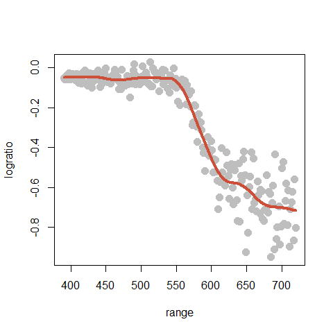
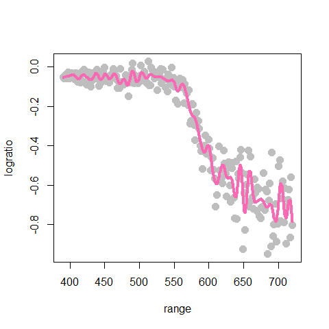
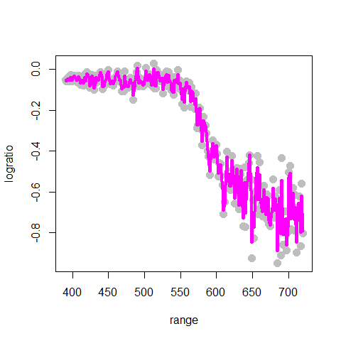
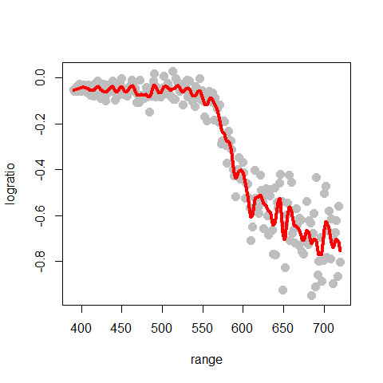
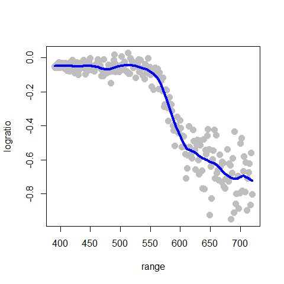
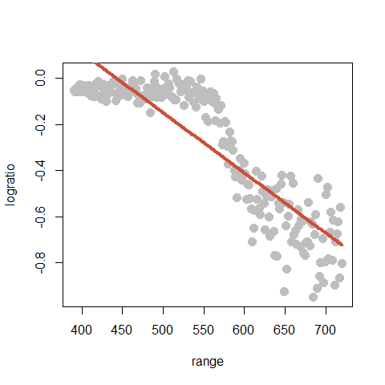
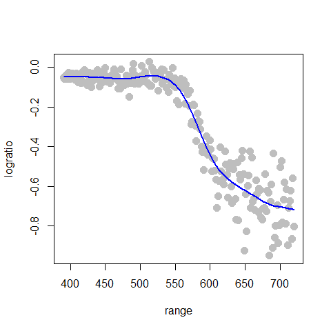
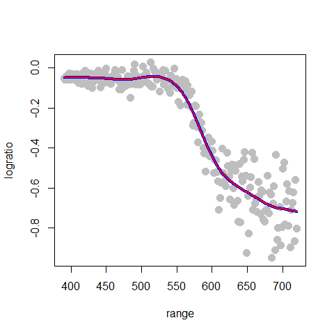

STAT406 - Lecture 8 notes
================
Matias Salibian-Barrera
2017-09-27

Lecture slides
--------------

The lecture slides are [here](STAT406-17-lecture-8-preliminary.pdf).

Non-parametric regression
=========================

We now turn our attention to the situation where the regression function E(Y|X) is not necessarily linear. Furthermore, we will assume that its *form* is **unknown**. If we knew that the regression function was a polynomial in the coordinates of the vector X (e.g. a quadratic function), or if we knew that the true regression function belonged to a family of functions that we can parametrize, then the regression function could be estimated via least squares. Instead here we focus on the case where the regression function is **completely unknown**.

Below we will discuss two main approaches to estimating E(Y|X):

1.  one using bases (e.g. a polynomial basis, or a spline basis); and
2.  one using kernels (aka local regression).

To simplify the presentation (but also because of an intrinsic limitation of these methods, which will be discussed in more detail later), we will initially only consider the case where there is a single explanatory variable (i.e. X above is a scalar, not a vector).

Polynomial regression
---------------------

To illustrate these basis methods, we will consider the `lidar` data, available in the package `SemiPar`. More information is available from the corresponding help page: `help(lidar, package='SemiPar')`. We now load the data and plot it, the response variable is `logratio` and the explanatory one is `range`:

``` r
# help(lidar, package='SemiPar')

data(lidar, package='SemiPar')
plot(logratio ~ range, data=lidar, pch=19, col='gray', cex=1.5)
```


It is easy to verify that if we model the regression function as a 4th degree polynomial, the problem reduces to a linear regression one (see the lecture slides). So we could use a command like `lm(logratio ~ range + range^2 + range^3 + range^4)`. However, that approach will not work as we intend it (I recommend that you check this and find out the reason why). Instead, we would need to use something like `lm(logratio ~ range + I(range^2) + I(range^3) ... )`, which can quickly get clumsy and error-prone. We can instead use the function `poly()` in `R` to generate the matrix containing the powers of `range`, and plug that into the call to `lm()`. The code below fits such an approximation, plots the data and overlays the estimated regression function:

``` r
# Degree 4 polynomials
pm <- lm(logratio ~ poly(range, 4), data=lidar)
plot(logratio ~ range, data=lidar, pch=19, col='gray', cex=1.5)
lines(predict(pm)[order(range)] ~ sort(range), data=lidar, lwd=4, col='blue')
```


Note that this fit is reasonable, although there is probably room for improvement. It is tempting to increase the order of the approximating polynomial, however, this is easily seen not to be a good idea. Below we compare the 4th degree approximation used above (in blue) with a 10th degree one (in red):

``` r
# Degree 10 polynomials
pm2 <- lm(logratio ~ poly(range, 10), data=lidar)
plot(logratio ~ range, data=lidar, pch=19, col='gray', cex=1.5)
lines(predict(pm)[order(range)] ~ sort(range), data=lidar, lwd=4, col='blue')
lines(predict(pm2)[order(range)]~sort(range), data=lidar, lwd=4, col='red')
```


Note that the 10th order fit follows the data much more closely, but it starts to become "too adaptive" and departing quite often from the main (larger scale) trend we associate with the regression (conditional mean) function.

A more stable basis: splines
----------------------------

Part of the problem with polynomial bases is that they necessarily become more wiggly within the range of the data, and also quickly increase or decrease near the edge of the observations. A more stable but also remarkably flexible basis is given by spline functions, as discussed in class.

We first here show how to build a naive linear spline basis with 5 knots (placed at the `(1:5)/6` quantiles (i.e. the 0.17, 0.33, 0.5, 0.67, 0.83 percentiles) of the observed values of the explanatory variable), and use it to estimate the regression function. Remember that a linear spline function with knot *w* is given by `f_w(x) = max( x - w, 0 )`. Given a fixed set of pre-selected knots *w\_1*, *w\_2*, ..., *w\_k*, we consider regreesion functions that are linear combinations of the corresponding k linear spline functions.

Note that for higher-order splines (e.g. cubic splines discussed below), the naive spline basis used above is numerically very unstable, and usually works poorly in practice. I include here simply as an illustration of the methodology and to stress the point that these basis approaches are in fact nothing more than slightly more complex linear models.

First we find the 5 knots mentioned above:

``` r
# select the knots at 5 specific quantiles
( kn <- as.numeric( quantile(lidar$range, (1:5)/6) ) )
```

    ## [1] 444.6667 499.6667 555.0000 609.6667 664.6667

Now we compute the matrix of "explanatory variables", that is the matrix that has each of the 5 basis functions *f\_1*, *f\_2*, ..., *f\_5* evaluated at the n observed values of the (single) explanatory variable *x\_1*, ..., *x\_n*. In other words, the matrix **X** has in its (i, j) cell the value *f\_j(x\_i)*, for *j=1*, ..., *k*, and *i=1*, ..., *n*. In the code below we use / abuse *recycling* rules used by `R` when operating with vectors and arrays (can you spot it?)

``` r
# prepare the matrix of covariates / explanatory variables
x <- matrix(0, dim(lidar)[1], length(kn)+1)
for(j in 1:length(kn)) {
  x[,j] <- pmax(lidar$range-kn[j], 0)
}
x[, length(kn)+1] <- lidar$range
```

Now that we have the matrix of our "explanatory variables", we can simply use `lm` to estimate the coefficients of the linear combination of the functions in the spline basis that will provide our regression function estimator. We then plot the data and overlay the fitted / estimated regression function:

``` r
# Fit the regression model
ppm <- lm(lidar$logratio ~ x)
plot(logratio~range, data=lidar, pch=19, col='gray', cex=1.5)
lines(predict(ppm)[order(range)]~sort(range), data=lidar, lwd=6, col='hotpink')
```


There are better (more stable) bases for the same linear space spanned by these spline functions. Here we use the function `bs` to build a b-spline basis. Given the chosen knots and the degree of the splines (linear, quadratic, cubic, etc.) the set of possible functions (a linear space, really) is the same regardless of the basis we use. As a consequence, the estimated regression function should be identical for any basis we use (provided we do not run into serious numerical issues). To illustrate this fact, we will use a B-spline basis with the same 5 knots as above, and compare the estimated regression function with the one we obtained above using our **poor people** naive basis. The plot below overlays both fits (the naive one with a thick pink line as above, and the one using b-splines with a thinner blue line):

``` r
# a better way to obtain the same fit
library(splines)
ppm2 <- lm(logratio ~ bs(range, degree=1, knots=kn), data=lidar)
plot(logratio~range, data=lidar, pch=19, col='gray', cex=1.5)
lines(predict(ppm)[order(range)]~sort(range), data=lidar, lwd=8, col='hotpink')
lines(predict(ppm2)[order(range)]~sort(range), data=lidar, lwd=2, col='darkblue')
```


As expected, both provide the same estimated regression function.

Note that because we are using a set of linear splines, our estimated regression functions will always be piece-wise linear. To obtain smoother (e.g. differentiable, or even continuously differentiable) regression estimators we can use higher-order splines.

### Higher order splines (quadratic, cubic, etc.)

Here we do not even try to build the spline basis by hand, and directly use the function `bs` to evaluate the desired spline basis on the observed values of the explanatory variable (in this case `range`). We use the arguments `degree = 2` and `knots = kn` to indicate we want a quadratic spline basis with knots located at the elements of the vector `kn`. As before, we then simply use `lm` to estimate the coefficients, and overlay the estimated regression function over the data:

``` r
plot(logratio~range, data=lidar, pch=19, col='gray', cex=1.5)
ppmq <- lm(logratio ~ bs(range, degree=2, knots=kn), data=lidar)
lines(predict(ppmq)[order(range)]~sort(range), data=lidar, lwd=4, col='steelblue')
```


A useful consequence of the fact that these regression estimators are in the end just linear regression estimators (but using a richer / more flexible basis than just the straight predictors) is that we can easily compute (pointwise) standard errors for the fitted regression curve.

We first fit and plot a quadratic spline using the same 5 knots as before:

``` r
# k <- 5
# kn <- as.numeric( quantile(lidar$range, (1:k)/(k+1)) )
plot(logratio~range, data=lidar, pch=19, col='gray', cex=1.5)
ppmc <- lm(logratio ~ bs(range, degree=2, knots=kn), data=lidar)
lines(predict(ppmc)[order(range)]~sort(range), data=lidar, lwd=4, col='gray30')
```

To compute the estimated standard error of the predicted regression curve on a grid of values of the explanatory variable `range`, we first build a grid of 200 equally spaced points within the observed scope of the variable `range`:

``` r
xx <- seq(min(lidar$range), max(lidar$range), length=200)
```

The `predict` method for `lm` objects returns estimated standard errors for each fitted value if we set the argument `se.fit = TRUE`:

``` r
ppmc <- lm(logratio ~ bs(range, degree=2, knots=kn), data=lidar)
ps <- predict(ppmc, newdata=list(range=xx), se.fit=TRUE)
```

We now compute upper and lower confidence bands (I used 2 standard errors) around the fitted regression line:

``` r
up <- (ps$fit+2*ps$se.fit)
lo <- (ps$fit-2*ps$se.fit)
```

The following code relies on **base R** graphical commands to display the *confidence bands* we just constructed:

``` r
plot(logratio~range, data=lidar, pch=19, col='gray', cex=1.5)
lines(predict(ppmc)[order(range)]~sort(range), data=lidar, lwd=4, col='gray30')
myrgb <- col2rgb('red') / 256 #, alpha=TRUE)
myrgb <- rgb(red=myrgb[1], green=myrgb[2], blue=myrgb[3], alpha=.3)
polygon(c(xx, rev(xx)), c(up, rev(lo)), density=NA, col=myrgb) #'lightblue')
lines(ps$fit~xx, data=lidar, lwd=4, col='blue')
```


> It is important to note that the above confidence bands were constructed assuming that the knots were fixed (not random), and similarly for the degree of the spline basis.

Increasing the degree of the cubic basis yields smoother fits (having higher order continuous derivatives). For example, using cubic splines yield an even smoother fit:

``` r
# cubic splines
plot(logratio~range, data=lidar, pch=19, col='gray', cex=1.5)
ppmc <- lm(logratio ~ bs(range, degree=3, knots=kn), data=lidar)
lines(predict(ppmc)[order(range)]~sort(range), data=lidar, lwd=4, col='tomato3')
```


Note that the estimated regression function seems to have started to "twitch" and wiggle, particularly at the upper end of our observations.

How many knots should we use?
-----------------------------

So far we have used 5 knots, but we could have used any other number of knots. If we consider a quadratic spline basis with 10 knots, the fit appears a bit better (at least aesthetically):

``` r
k <- 10
kn <- as.numeric( quantile(lidar$range, (1:k)/(k+1)) )
plot(logratio~range, data=lidar, pch=19, col='gray', cex=1.5)
ppmc <- lm(logratio ~ bs(range, degree=2, knots=kn), data=lidar)
lines(predict(ppmc)[order(range)]~sort(range), data=lidar, lwd=4, col='tomato3')
```



What about using more knots? We will try 50:

``` r
# quadratic splines with 50 knots
k <- 50
kn <- as.numeric( quantile(lidar$range, (1:k)/(k+1)) )
ppmc <- lm(logratio ~ bs(range, degree=2, knots=kn), data=lidar)
plot(logratio~range, data=lidar, pch=19, col='gray', cex=1.5)
lines(predict(ppmc)[order(range)]~sort(range), data=lidar, lwd=4, col='hotpink')
```



Clearly not a good idea!

Upcoming
--------

-   We still need to choose the knots (both "how many" and their locations)
-   And we also need to choose the order of the spline basis
-   A neat property of *natural cubic splines* will simplify our approach, showing that we only need to consider regularized (penalized) *natural cubic splines* with *n* knots, one per observed value of the explanatory variable. Then, we will only to choose the value of the penalization term.
-   *natural cubic splines* are linear beyond the first and last knot, and thus will not "twich" at the edges, and will provide a more stable regression estimator.

Smoothing splines
-----------------

The function `smooth.spline` computes a cubic smoothing spline (natural cubic spline). We try a value of the penalization parameter chosen by hand `spar = 0.2`:

``` r
plot(logratio~range, data=lidar, pch=19, col='gray', cex=1.5)
tmp <- smooth.spline(x=lidar$range, y=lidar$logratio, spar=.2, cv=FALSE,
                     all.knots=TRUE)
lines(tmp$y~tmp$x, lwd=4, col='magenta')
```



Clearly not enough. We increase it to 0.5:

``` r
plot(logratio~range, data=lidar, pch=19, col='gray', cex=1.5)
tmp <- smooth.spline(x=lidar$range, y=lidar$logratio, spar=.5, cv=FALSE,
                     all.knots=TRUE)
lines(tmp$y~tmp$x, lwd=4, col='red')
```



The larger the penalty parameter, the closer the fit gets to a linear function (why?), we now set it to 0.8:

``` r
plot(logratio~range, data=lidar, pch=19, col='gray', cex=1.5)
tmp <- smooth.spline(x=lidar$range, y=lidar$logratio, spar=.8, cv=FALSE,
                     all.knots=TRUE)
lines(tmp$y~tmp$x, lwd=4, col='blue')
```



... and to 2:

``` r
plot(logratio~range, data=lidar, pch=19, col='gray', cex=1.5)
tmp <- smooth.spline(x=lidar$range, y=lidar$logratio, spar=2, cv=FALSE,
                     all.knots=TRUE)
lines(tmp$y~tmp$x, lwd=4, col='tomato3')
```



Use CV to select the penalty parameter (knots and degree of splines are given)
------------------------------------------------------------------------------

<!-- # using CV -->
``` r
tmp.cv <- smooth.spline(x=lidar$range, y=lidar$logratio, cv=TRUE,
                        all.knots=TRUE)
# tmp.cv$spar = 0.974
plot(logratio~range, data=lidar, pch=19, col='gray', cex=1.5)
lines(tmp.cv$y~tmp.cv$x, lwd=2, col='blue')
```



Which is the same as doing:

``` r
plot(logratio~range, data=lidar, pch=19, col='gray', cex=1.5)
lines(tmp.cv$y~tmp.cv$x, lwd=4, col='blue')
tmp <- smooth.spline(x=lidar$range, y=lidar$logratio, spar=tmp.cv$spar, cv=FALSE,
                     all.knots=TRUE)
lines(tmp$y~tmp$x, lwd=2, col='red')
```


