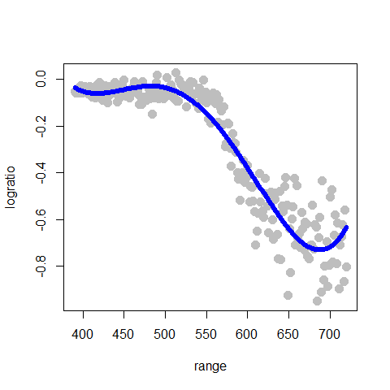
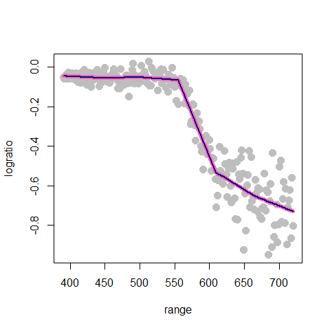

STAT406 - Lecture 8 notes
================
Matias Salibian-Barrera
2017-09-26

Lecture slides
--------------

The lecture slides are [here](STAT406-17-lecture-8-preliminary.pdf).

Non-parametric regression
=========================

We now turn our attention to the situation where the regression function E(Y|X) is not necessarily linear. Furthermore, we will assume that its "form" is **unknown**. If we knew that the regression function was a polynomial in the coordinates of the vector X (e.g. a quadratic function), or if we knew that the true regression function belonged to a family of functions that we can parametrize, then the regression function could be estimated via least squares. Instead here we focus on the case where the regression function is **completely unknown**.

Below we will discuss two main approaches to estimating E(Y|X):

1.  one using bases (e.g. a polynomial basis, or a spline basis); and
2.  one using kernels (aka local regression).

To simplify the presentation, and also because of an intrinsic limitation of these methods (which will be discussed in more detail later), we will initially only consider the case where there is a single explanatory variable (i.e. X above is a scalar, not a vector).

Polynomial regression
---------------------

To illustrate these basis methods, we will consider the `lidar` data, available in the package `SemiPar`. More information is available from the corresponding help page: `help(lidar, package='SemiPar')`. We now load the data and plot it, the response variable is `logratio` and the explanatory one is `range`:

``` r
# help(lidar, package='SemiPar')

data(lidar, package='SemiPar')
plot(logratio ~ range, data=lidar, pch=19, col='gray', cex=1.5)
```


It is easy to verify that if we model the regression function as a 4th degree polynomial, the problem reduces to a linear regression one (see the lecture slides). So we could use a command like `lm(logratio ~ range + range^2 + range^3 + range^4)`. However, that approach will not work as we intend it (I recommend that you check this and find out the reason why). Instead, we would need to use something like `lm(logratio ~ range + I(range^2) + I(range^3) ... )`, which can quickly get clumsy and error-prone. We can instead use the function `poly()` in `R` to generate the matrix containing the powers of `range`, and plug that into the call to `lm()`. The code below fits such an approximation, plots the data and overlays the estimated regression function:

``` r
# Degree 4 polynomials
pm <- lm(logratio ~ poly(range, 4), data=lidar)
plot(logratio ~ range, data=lidar, pch=19, col='gray', cex=1.5)
lines(predict(pm)[order(range)] ~ sort(range), data=lidar, lwd=4, col='blue')
```



Note that this fit is reasonable, although there is probably room for improvement. It is tempting to increase the order of the approximating polynomial, however, this is easily seen not to be a good idea. Below we compare the 4th degree approximation used above (in blue) with a 10th degree one (in red):

``` r
# Degree 10 polynomials
pm2 <- lm(logratio ~ poly(range, 10), data=lidar)
plot(logratio ~ range, data=lidar, pch=19, col='gray', cex=1.5)
lines(predict(pm)[order(range)] ~ sort(range), data=lidar, lwd=4, col='blue')
lines(predict(pm2)[order(range)]~sort(range), data=lidar, lwd=4, col='red')
```


A more stable basis: splines
----------------------------

Part of the problem with polynomial bases is that they necessarily become more wiggly within the range of the data, and also quickly increase or decrease near the edge of the observations. A more stable but also remarkably flexible basis is given by spline functions, as discussed in class.

We first here show how to build a naive spline basis with 5 knots (placed at the `(1:5)/6` quantiles (i.e. the 0.17, 0.33, 0.5, 0.67, 0.83 percentiles) of the observed values of the explanatory variable), and use it to estimate the regression function. Note that this naive spline basis is numerically very unstable, and thus one should not do this in practice. It is included here simply as an illustration of the methodology and to stress the point that these basis approaches are in fact nothing more than slightly more complex linear models.

``` r
# linear splines ``by hand''
# select the knots at 5 quantiles
kn <- as.numeric( quantile(lidar$range, (1:5)/6) )

# prepare the matrix of covariates / explanatory variables
x <- matrix(0, dim(lidar)[1], length(kn)+1)
for(j in 1:length(kn)) {
  x[,j] <- pmax(lidar$range-kn[j], 0)
}
x[, length(kn)+1] <- lidar$range

# Fit the regression model
ppm <- lm(lidar$logratio ~ x)
plot(logratio~range, data=lidar, pch=19, col='gray', cex=1.5)
lines(predict(ppm)[order(range)]~sort(range), data=lidar, lwd=6, col='hotpink')
```


There are better (more stable) bases for the same linear space spanned by these spline functions. Here we use the function `bs` to build a b-spline basis. To show that this in fact provides the exact same results as using our **poor person** solution above, I overlay both fits (the naive one in pink as above, and the one using b-splines in blue):

``` r
# a better way to obtain the same fit
library(splines)
ppm2 <- lm(logratio ~ bs(range, degree=1, knots=kn), data=lidar)
plot(logratio~range, data=lidar, pch=19, col='gray', cex=1.5)
lines(predict(ppm)[order(range)]~sort(range), data=lidar, lwd=6, col='hotpink')
lines(predict(ppm2)[order(range)]~sort(range), data=lidar, lwd=2, col='darkblue')
```



### Higher order splines (quadratic, cubic, etc.)

``` r
plot(logratio~range, data=lidar, pch=19, col='gray', cex=1.5)
ppmq <- lm(logratio ~ bs(range, degree=2, knots=kn), data=lidar)
lines(predict(ppmq)[order(range)]~sort(range), data=lidar, lwd=4, col='steelblue')
```


``` r
# cubic splines
plot(logratio~range, data=lidar, pch=19, col='gray', cex=1.5)
ppmc <- lm(logratio ~ bs(range, degree=3, knots=kn), data=lidar)
lines(predict(ppmc)[order(range)]~sort(range), data=lidar, lwd=4, col='tomato3')
```


