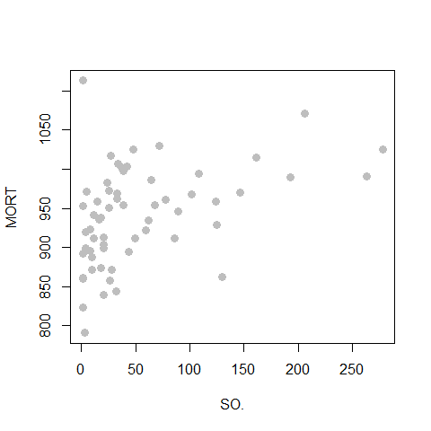
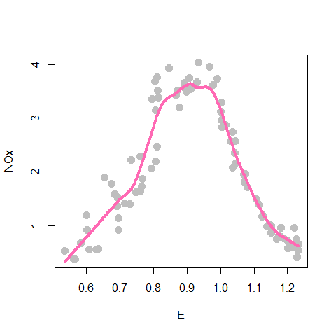

STAT406 - Lecture 9 notes
================
Matias Salibian-Barrera
2017-09-30

Lecture slides
--------------

The lecture slides are [here](STAT406-17-lecture-9-preliminary.pdf).

Kernel regression / local regression
------------------------------------

A different approach to constructing an estimated regression function is based on recalling that definition of the regression function is f(a) = E(Y | X = a), the mean of the response variable **conditional** to the fact that the explanatory variable(s) **X** equal(s) **a**. If we had lots of data, we could, in principle, think of the following intuitively simple regression estimator: given **c**, consider all observations (Y, **X**) in your training set that have **X = c**, and take the average of the corresponding observed values of the response variable Y. This would be a resonable estimator for E(Y | **X** = **c** ) (if we had sufficient cases in our training data pairs for which **X** = **c**).

Although the simple approach above does not usually work in practice (because we do not have training data with **X** = **c** for arbitrary values of **c**), the idea can still be used to construct a regression estimator that works **locally**, i.e. that given **c** uses the points in the training set that have **X** close to **c** (you can think of this as *working with the neighbours* of **c**). This family of regression estimators are called *local regression*, or *kernel regression*, because we will use a specific family of functions (called kernels) to define what is a *neighbour* and how they will be used. These *kernels* are different from those used in Support Vector Machines and other reproducible kernel Hilbert spaces methods.

Probably the simplest kernel regression estimator would be to take the average of the responses of the training points where the explanatory variables are within *h* of the point of interest. This "window width" *h* is called the *bandwidth*. We can use the function `ksmooth` in package `KernSmooth` in `R` to do this (but it would be a great exercise to write your own `R` function to do it). The code below considers one specific explanatory variable for the air pollution data (just for illustration purposes) and fits a local averages regression estimator, with bandwidth 50:

``` r
dat <- read.table('../Lecture1/rutgers-lib-30861_CSV-1.csv', header=TRUE, sep=',')
library(KernSmooth)
x <- dat$SO.
y <- dat$MORT
h <- 50
a <- ksmooth(x=x, y=y, kernel='box', bandwidth=h, n.points=1000)
plot(y ~ x, pch=19, col='gray', cex=1.3, xlab='SO.', ylab='MORT')
lines(a$x, a$y, lwd=4, col='blue')
```



Note the gaps in the estimated regression function. Why do you think they happened?

``` r
h <- 60
a <- ksmooth(x=x, y=y, kernel='box', bandwidth=h, n.points=1000)
plot(y ~ x, pch=19, col='gray', cex=1.3, xlab='SO.', ylab='MORT')
lines(a$x, a$y, lwd=4, col='blue')
```


Note the *staircase* jagged shape of the curve. Can you explain why it happens?

``` r
h <- 60
a <- ksmooth(x=x, y=y, kernel='normal', bandwidth=h, n.points=1000)
plot(y ~ x, pch=19, col='gray', cex=1.3, xlab='SO.', ylab='MORT')
lines(a$x, a$y, lwd=4, col='blue')
```


Variable bandwidths, the function `loess`. Another example, look at `help(ethanol, package='SemiPar')` for details.

``` r
data(ethanol, package='SemiPar')
# local constant
span <- .4
b0 <- loess(NOx ~ E, data=ethanol, span=span, degree=0, family='gaussian')
plot(NOx ~ E, data=ethanol, pch=19, col='gray', cex=1.3, xlab='SO.', ylab='MORT')
tmp <- order(b0$x)
lines(b0$x[tmp], b0$fitted[tmp], lwd=4, col='blue')
```


``` r
# local linear
span <- .4
b1 <- loess(NOx ~ E, data=ethanol, span=span, degree=1, family='gaussian')
plot(NOx ~ E, data=ethanol, pch=19, col='gray', cex=1.3, xlab='SO.', ylab='MORT')
tmp <- order(b1$x)
lines(b1$x[tmp], b1$fitted[tmp], lwd=4, col='red')
```


``` r
span <- .4
b1 <- loess(NOx ~ E, data=ethanol, span=span, degree=1, family='gaussian')
plot(NOx ~ E, data=ethanol, pch=19, col='gray', cex=1.3, xlab='SO.', ylab='MORT')
tmp <- order(b1$x)
lines(b0$x[tmp], b0$fitted[tmp], lwd=4, col='blue')
lines(b1$x[tmp], b1$fitted[tmp], lwd=4, col='red')
```


``` r
# local quad
span <- .4
b2 <- loess(NOx ~ E, data=ethanol, span=span, degree=2, family='gaussian')
plot(NOx ~ E, data=ethanol, pch=19, col='gray', cex=1.3, xlab='SO.', ylab='MORT')
tmp <- order(b2$x)
lines(b1$x[tmp], b1$fitted[tmp], lwd=4, col='red')
lines(b2$x[tmp], b2$fitted[tmp], lwd=4, col='springgreen3')
```


Kernel (local) regression using `loess()` on the `Ethanol` data.

Effect of span. Local linear, small span (.05)

``` r
data(ethanol, package='SemiPar')

tmp <- loess(NOx ~ E, data=ethanol, span = .05, degree=1, family='gaussian')
plot(NOx ~ E, data=ethanol, pch=19, col='gray', cex=1.5)
# artificial grid of values to show predictions for the plot
prs <- with(ethanol, seq(min(E), max(E), length=1000))
lines(predict(tmp, newdata=prs) ~ prs, data=ethanol, lwd=4, col='steelblue')
```


Better span (0.25, and 0.50), still linear:

``` r
tmp <- loess(NOx ~ E, data=ethanol, span = .25, degree=1, family='gaussian')
plot(NOx ~ E, data=ethanol, pch=19, col='gray', cex=1.5)
lines(predict(tmp, newdata=prs) ~ prs, data=ethanol, lwd=4, col='hotpink')
```



``` r
tmp <- loess(NOx ~ E, data=ethanol, span = .5, degree=1, family='gaussian')
plot(NOx ~ E, data=ethanol, pch=19, col='gray', cex=1.5)
lines(predict(tmp, newdata=prs) ~ prs, data=ethanol, lwd=4, col='hotpink')
```


Effect of the degree, now quadratic:

``` r
tmp <- loess(NOx ~ E, data=ethanol, span = .5, degree=2, family='gaussian')
plot(NOx ~ E, data=ethanol, pch=19, col='gray', cex=1.5)
lines(predict(tmp, newdata=prs) ~ prs, data=ethanol, lwd=4, col='blue')
```


Now quadratic, span = 0.20

``` r
tmp <- loess(NOx ~ E, data=ethanol, span = .2, degree=2, family='gaussian')
plot(NOx ~ E, data=ethanol, pch=19, col='gray', cex=1.5)
lines(predict(tmp)[order(E)] ~ sort(E), data=ethanol, lwd=4, col='steelblue')
lines(predict(tmp, newdata=prs) ~ prs, data=ethanol, lwd=2, col='red2')
```


Kinks are artifact of sparsity of data
