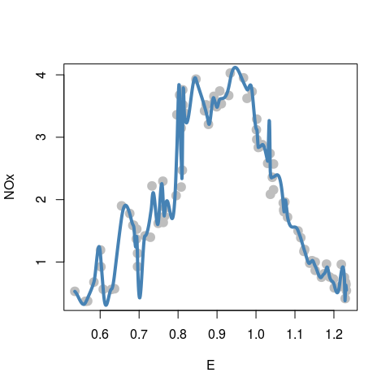
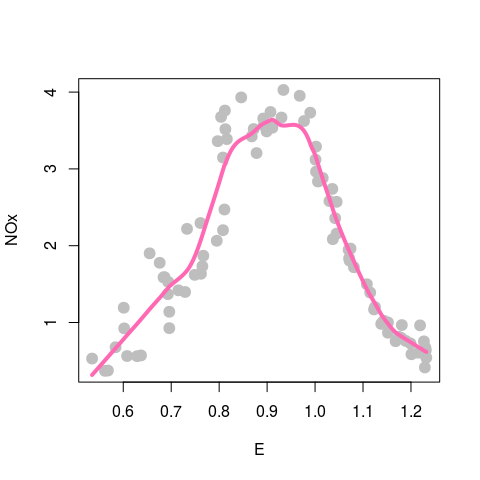

STAT406 - Lecture 9 notes
================
Matias Salibian-Barrera
2017-09-29

Lecture slides
--------------

The lecture slides are [here](STAT406-17-lecture-9-preliminary.pdf).

Kernel regression / local regression
------------------------------------

Kernel (local) regression using `loess()` on the `Ethanol` data.

Effect of span. Local linear, small span (.05)

``` r
data(ethanol, package='SemiPar')

tmp <- loess(NOx ~ E, data=ethanol, span = .05, degree=1, family='gaussian')
plot(NOx ~ E, data=ethanol, pch=19, col='gray', cex=1.5)
# artificial grid of values to show predictions for the plot
prs <- with(ethanol, seq(min(E), max(E), length=1000))
lines(predict(tmp, newdata=prs) ~ prs, data=ethanol, lwd=4, col='steelblue')
```



Better span (0.25, and 0.50), still linear:

``` r
tmp <- loess(NOx ~ E, data=ethanol, span = .25, degree=1, family='gaussian')
plot(NOx ~ E, data=ethanol, pch=19, col='gray', cex=1.5)
lines(predict(tmp, newdata=prs) ~ prs, data=ethanol, lwd=4, col='hotpink')
```



``` r
tmp <- loess(NOx ~ E, data=ethanol, span = .5, degree=1, family='gaussian')
plot(NOx ~ E, data=ethanol, pch=19, col='gray', cex=1.5)
lines(predict(tmp, newdata=prs) ~ prs, data=ethanol, lwd=4, col='hotpink')
```


Effect of the degree, now quadratic:

``` r
tmp <- loess(NOx ~ E, data=ethanol, span = .5, degree=2, family='gaussian')
plot(NOx ~ E, data=ethanol, pch=19, col='gray', cex=1.5)
lines(predict(tmp, newdata=prs) ~ prs, data=ethanol, lwd=4, col='blue')
```


Now quadratic, span = 0.20

``` r
tmp <- loess(NOx ~ E, data=ethanol, span = .2, degree=2, family='gaussian')
plot(NOx ~ E, data=ethanol, pch=19, col='gray', cex=1.5)
lines(predict(tmp)[order(E)] ~ sort(E), data=ethanol, lwd=4, col='steelblue')
lines(predict(tmp, newdata=prs) ~ prs, data=ethanol, lwd=2, col='red2')
```


Kinks are artifact of sparsity of data
